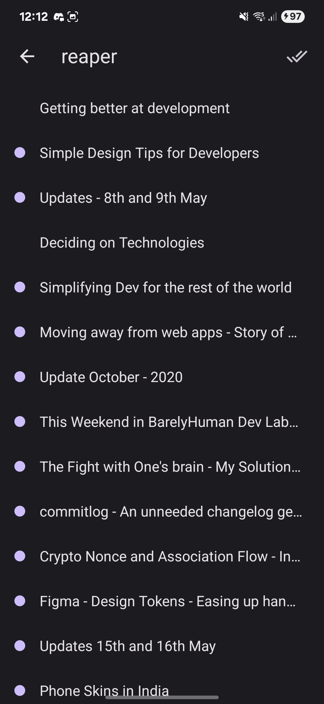
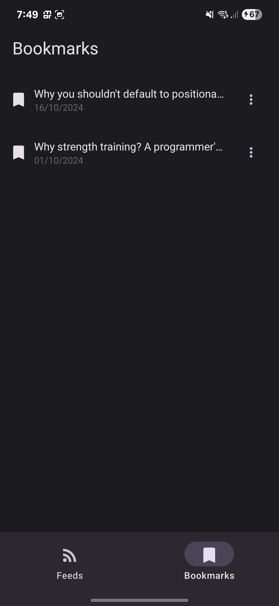

This file is a merged representation of the entire codebase, combined into a single document by Repomix.
The content has been processed where comments have been removed, empty lines have been removed, security check has been disabled.

# File Summary

## Purpose
This file contains a packed representation of the entire repository's contents.
It is designed to be easily consumable by AI systems for analysis, code review,
or other automated processes.

## File Format
The content is organized as follows:
1. This summary section
2. Repository information
3. Directory structure
4. Repository files (if enabled)
5. Multiple file entries, each consisting of:
  a. A header with the file path (## File: path/to/file)
  b. The full contents of the file in a code block

## Usage Guidelines
- This file should be treated as read-only. Any changes should be made to the
  original repository files, not this packed version.
- When processing this file, use the file path to distinguish
  between different files in the repository.
- Be aware that this file may contain sensitive information. Handle it with
  the same level of security as you would the original repository.

## Notes
- Some files may have been excluded based on .gitignore rules and Repomix's configuration
- Binary files are not included in this packed representation. Please refer to the Repository Structure section for a complete list of file paths, including binary files
- Files matching patterns in .gitignore are excluded
- Files matching default ignore patterns are excluded
- Code comments have been removed from supported file types
- Empty lines have been removed from all files
- Security check has been disabled - content may contain sensitive information
- Files are sorted by Git change count (files with more changes are at the bottom)

# Directory Structure
```
__tests__/
  App.test.tsx
.github/
  workflows/
    android.yml
android/
  app/
    src/
      debug/
        AndroidManifest.xml
      main/
        java/
          com/
            feedit/
              MainActivity.kt
              MainApplication.kt
        res/
          drawable/
            rn_edit_text_material.xml
          mipmap-anydpi-v26/
            ic_launcher.xml
          mipmap-hdpi/
            ic_launcher_background.png
            ic_launcher_foreground.png
            ic_launcher_monochrome.png
            ic_launcher.png
          mipmap-mdpi/
            ic_launcher_background.png
            ic_launcher_foreground.png
            ic_launcher_monochrome.png
            ic_launcher.png
          mipmap-xhdpi/
            ic_launcher_background.png
            ic_launcher_foreground.png
            ic_launcher_monochrome.png
            ic_launcher.png
          mipmap-xxhdpi/
            ic_launcher_background.png
            ic_launcher_foreground.png
            ic_launcher_monochrome.png
            ic_launcher.png
          mipmap-xxxhdpi/
            ic_launcher_background.png
            ic_launcher_foreground.png
            ic_launcher_monochrome.png
            ic_launcher.png
          values/
            strings.xml
            styles.xml
        AndroidManifest.xml
    build.gradle
    debug.keystore
    proguard-rules.pro
  gradle/
    wrapper/
      gradle-wrapper.jar
      gradle-wrapper.properties
  build.gradle
  gradle.properties
  gradlew
  gradlew.bat
  settings.gradle
docs/
  assets/
    bookmark.jpg
    feed.jpg
    home.jpg
    setting.jpg
fastlane/
  Appfile
  Fastfile
  README.md
ios/
  feedit/
    Images.xcassets/
      AppIcon.appiconset/
        Contents.json
      Contents.json
    AppDelegate.swift
    Info.plist
    LaunchScreen.storyboard
    PrivacyInfo.xcprivacy
  feedit.xcodeproj/
    xcshareddata/
      xcschemes/
        feedit.xcscheme
    project.pbxproj
  .xcode.env
  Podfile
patches/
  react-native-paper+5.14.5.patch
scripts/
  build-apk.sh
src/
  components/
    AddFeedFAB.tsx
    FeedItemList.tsx
    FeedList.tsx
    FeedRightIcons.tsx
    FeedSelectIcon.tsx
    FeedUnreadDot.tsx
    Toast.tsx
  lib/
    store/
      bookmarks.ts
      feed.ts
      opmlImportStore.ts
    chunkAsyncStore.ts
    url.ts
  navigation/
    Navigation.tsx
    RootStack.tsx
  pages/
    BookmarksPage.tsx
    FeedPage.tsx
    HomePage.tsx
    SettingsPage.tsx
  styles/
    styles.ts
  App.tsx
.eslintrc.js
.gitignore
.prettierrc.js
.watchmanconfig
.yarnrc.yml
app.json
babel.config.js
Gemfile
index.js
jest.config.js
metro.config.js
mise.toml
package.json
playstore.png
README.md
tsconfig.json
```

# Files

## File: __tests__/App.test.tsx
````typescript
import React from 'react';
import ReactTestRenderer from 'react-test-renderer';
import App from '../src/App';
test('renders correctly', async () => {
  await ReactTestRenderer.act(() => {
    ReactTestRenderer.create(<App />);
  });
});
````

## File: .github/workflows/android.yml
````yaml
name: Android Builds
on:
  workflow_dispatch:
jobs:
  build:
    runs-on: ubuntu-latest
    steps:
      - uses: actions/checkout@08c6903cd8c0fde910a37f88322edcfb5dd907a8
      - uses: jdx/mise-action@v3
      - name: Cache Gradle
        uses: actions/cache@v4
        with:
          path: |
            ~/.gradle/caches
            ~/.gradle/wrapper
          key:
            gradle-${{ hashFiles('**/*.gradle*', '**/gradle-wrapper.properties',
            '**/gradle.properties') }}
          restore-keys: |
            gradle-
      - name: Set Up JDK
        uses: actions/setup-java@dded0888837ed1f317902acf8a20df0ad188d165
        with:
          distribution: 'temurin'
          java-version: 17
      - name: Install
        run: |
          npm i -g corepack@latest
          corepack enable
          yarn
          bundle install
      - name: Build Project
        run: |
          bundle exec fastlane android build
      - name: Upload APK Artifact
        uses: actions/upload-artifact@ea165f8d65b6e75b540449e92b4886f43607fa02
        with:
          name: feedit-apk
          path: ./dist/android/*.apk
````

## File: android/app/src/debug/AndroidManifest.xml
````xml
<?xml version="1.0" encoding="utf-8"?>
<manifest xmlns:android="http://schemas.android.com/apk/res/android"
    xmlns:tools="http://schemas.android.com/tools">
    <application
        android:usesCleartextTraffic="true"
        tools:targetApi="28"
        tools:ignore="GoogleAppIndexingWarning"/>
</manifest>
````

## File: android/app/src/main/java/com/feedit/MainActivity.kt
````kotlin
package com.feedit
import android.os.Bundle
import com.facebook.react.ReactActivity
import com.facebook.react.ReactActivityDelegate
import com.facebook.react.defaults.DefaultNewArchitectureEntryPoint.fabricEnabled
import com.facebook.react.defaults.DefaultReactActivityDelegate
class MainActivity : ReactActivity() {
override fun getMainComponentName(): String = "feedit"
override fun onCreate(savedInstanceState: Bundle?) {
super.onCreate(null)
}
override fun createReactActivityDelegate(): ReactActivityDelegate =
DefaultReactActivityDelegate(this, mainComponentName, fabricEnabled)
}
````

## File: android/app/src/main/java/com/feedit/MainApplication.kt
````kotlin
package com.feedit
import android.app.Application
import com.facebook.react.PackageList
import com.facebook.react.ReactApplication
import com.facebook.react.ReactHost
import com.facebook.react.ReactNativeApplicationEntryPoint.loadReactNative
import com.facebook.react.ReactNativeHost
import com.facebook.react.ReactPackage
import com.facebook.react.defaults.DefaultReactHost.getDefaultReactHost
import com.facebook.react.defaults.DefaultReactNativeHost
class MainApplication : Application(), ReactApplication {
  override val reactNativeHost: ReactNativeHost =
      object : DefaultReactNativeHost(this) {
        override fun getPackages(): List<ReactPackage> =
            PackageList(this).packages.apply {
            }
        override fun getJSMainModuleName(): String = "index"
        override fun getUseDeveloperSupport(): Boolean = BuildConfig.DEBUG
        override val isNewArchEnabled: Boolean = BuildConfig.IS_NEW_ARCHITECTURE_ENABLED
        override val isHermesEnabled: Boolean = BuildConfig.IS_HERMES_ENABLED
      }
  override val reactHost: ReactHost
    get() = getDefaultReactHost(applicationContext, reactNativeHost)
  override fun onCreate() {
    super.onCreate()
    loadReactNative(this)
  }
}
````

## File: android/app/src/main/res/drawable/rn_edit_text_material.xml
````xml
<?xml version="1.0" encoding="utf-8"?>
<inset xmlns:android="http://schemas.android.com/apk/res/android"
       android:insetLeft="@dimen/abc_edit_text_inset_horizontal_material"
       android:insetRight="@dimen/abc_edit_text_inset_horizontal_material"
       android:insetTop="@dimen/abc_edit_text_inset_top_material"
       android:insetBottom="@dimen/abc_edit_text_inset_bottom_material"
       >
    <selector>
        <item android:state_enabled="false" android:drawable="@drawable/abc_textfield_default_mtrl_alpha"/>
        <item android:drawable="@drawable/abc_textfield_activated_mtrl_alpha"/>
    </selector>
</inset>
````

## File: android/app/src/main/res/mipmap-anydpi-v26/ic_launcher.xml
````xml
<?xml version="1.0" encoding="utf-8"?>
<adaptive-icon xmlns:android="http://schemas.android.com/apk/res/android">
  <background android:drawable="@mipmap/ic_launcher_background"/>
  <foreground android:drawable="@mipmap/ic_launcher_foreground"/>
  <monochrome android:drawable="@mipmap/ic_launcher_monochrome"/>
</adaptive-icon>
````

## File: android/app/src/main/res/values/strings.xml
````xml
<resources>
    <string name="app_name">FeedIt</string>
</resources>
````

## File: android/app/src/main/res/values/styles.xml
````xml
<resources>
    <style name="AppTheme" parent="Theme.AppCompat.DayNight.NoActionBar">
        <item name="android:editTextBackground">@drawable/rn_edit_text_material</item>
    </style>
</resources>
````

## File: android/app/src/main/AndroidManifest.xml
````xml
<manifest xmlns:android="http://schemas.android.com/apk/res/android">
    <uses-permission android:name="android.permission.INTERNET" />
    <queries>
      <intent>
        <action android:name="android.intent.action.VIEW" />
        <data android:scheme="http"/>
      </intent>
      <intent>
        <action android:name="android.intent.action.VIEW" />
        <data android:scheme="https"/>
      </intent>
    </queries>
    <application
      android:name=".MainApplication"
      android:label="@string/app_name"
      android:icon="@mipmap/ic_launcher"
      android:roundIcon="@mipmap/ic_launcher"
      android:allowBackup="false"
      android:theme="@style/AppTheme"
      android:supportsRtl="true">
      <activity
        android:name=".MainActivity"
        android:label="@string/app_name"
        android:configChanges="keyboard|keyboardHidden|orientation|screenLayout|screenSize|smallestScreenSize|uiMode"
        android:launchMode="singleTask"
        android:windowSoftInputMode="adjustResize"
        android:exported="true">
        <intent-filter>
            <action android:name="android.intent.action.MAIN" />
            <category android:name="android.intent.category.LAUNCHER" />
        </intent-filter>
      </activity>
    </application>
</manifest>
````

## File: android/app/build.gradle
````
apply plugin: "com.android.application"
apply plugin: "org.jetbrains.kotlin.android"
apply plugin: "com.facebook.react"

/**
 * This is the configuration block to customize your React Native Android app.
 * By default you don't need to apply any configuration, just uncomment the lines you need.
 */
react {
    /* Folders */
    //   The root of your project, i.e. where "package.json" lives. Default is '../..'
    // root = file("../../")
    //   The folder where the react-native NPM package is. Default is ../../node_modules/react-native
    // reactNativeDir = file("../../node_modules/react-native")
    //   The folder where the react-native Codegen package is. Default is ../../node_modules/@react-native/codegen
    // codegenDir = file("../../node_modules/@react-native/codegen")
    //   The cli.js file which is the React Native CLI entrypoint. Default is ../../node_modules/react-native/cli.js
    // cliFile = file("../../node_modules/react-native/cli.js")

    /* Variants */
    //   The list of variants to that are debuggable. For those we're going to
    //   skip the bundling of the JS bundle and the assets. By default is just 'debug'.
    //   If you add flavors like lite, prod, etc. you'll have to list your debuggableVariants.
    // debuggableVariants = ["liteDebug", "prodDebug"]

    /* Bundling */
    //   A list containing the node command and its flags. Default is just 'node'.
    // nodeExecutableAndArgs = ["node"]
    //
    //   The command to run when bundling. By default is 'bundle'
    // bundleCommand = "ram-bundle"
    //
    //   The path to the CLI configuration file. Default is empty.
    // bundleConfig = file(../rn-cli.config.js)
    //
    //   The name of the generated asset file containing your JS bundle
    // bundleAssetName = "MyApplication.android.bundle"
    //
    //   The entry file for bundle generation. Default is 'index.android.js' or 'index.js'
    // entryFile = file("../js/MyApplication.android.js")
    //
    //   A list of extra flags to pass to the 'bundle' commands.
    //   See https://github.com/react-native-community/cli/blob/main/docs/commands.md#bundle
    // extraPackagerArgs = []

    /* Hermes Commands */
    //   The hermes compiler command to run. By default it is 'hermesc'
    // hermesCommand = "$rootDir/my-custom-hermesc/bin/hermesc"
    //
    //   The list of flags to pass to the Hermes compiler. By default is "-O", "-output-source-map"
    // hermesFlags = ["-O", "-output-source-map"]

    /* Autolinking */
    autolinkLibrariesWithApp()
}

/**
 * Set this to true to Run Proguard on Release builds to minify the Java bytecode.
 */
def enableProguardInReleaseBuilds = false

/**
 * The preferred build flavor of JavaScriptCore (JSC)
 *
 * For example, to use the international variant, you can use:
 * `def jscFlavor = io.github.react-native-community:jsc-android-intl:2026004.+`
 *
 * The international variant includes ICU i18n library and necessary data
 * allowing to use e.g. `Date.toLocaleString` and `String.localeCompare` that
 * give correct results when using with locales other than en-US. Note that
 * this variant is about 6MiB larger per architecture than default.
 */
def jscFlavor = 'io.github.react-native-community:jsc-android:2026004.+'

android {
    ndkVersion rootProject.ext.ndkVersion
    buildToolsVersion rootProject.ext.buildToolsVersion
    compileSdk rootProject.ext.compileSdkVersion

    namespace "com.feedit"
    defaultConfig {
        applicationId "com.feedit"
        minSdkVersion rootProject.ext.minSdkVersion
        targetSdkVersion rootProject.ext.targetSdkVersion
        versionCode 1
        versionName "1.0"
    }
    signingConfigs {
        debug {
            storeFile file('debug.keystore')
            storePassword 'android'
            keyAlias 'androiddebugkey'
            keyPassword 'android'
        }
    }
    buildTypes {
        debug {
            signingConfig signingConfigs.debug
        }
        release {
            // Caution! In production, you need to generate your own keystore file.
            // see https://reactnative.dev/docs/signed-apk-android.
            signingConfig signingConfigs.debug
            minifyEnabled enableProguardInReleaseBuilds
            proguardFiles getDefaultProguardFile("proguard-android.txt"), "proguard-rules.pro"
        }
    }
}

dependencies {
    // The version of react-native is set by the React Native Gradle Plugin
    implementation("com.facebook.react:react-android")

    if (hermesEnabled.toBoolean()) {
        implementation("com.facebook.react:hermes-android")
    } else {
        implementation jscFlavor
    }
}
````

## File: android/app/proguard-rules.pro
````
# Add project specific ProGuard rules here.
# By default, the flags in this file are appended to flags specified
# in /usr/local/Cellar/android-sdk/24.3.3/tools/proguard/proguard-android.txt
# You can edit the include path and order by changing the proguardFiles
# directive in build.gradle.
#
# For more details, see
#   http://developer.android.com/guide/developing/tools/proguard.html

# Add any project specific keep options here:
````

## File: android/gradle/wrapper/gradle-wrapper.properties
````
distributionBase=GRADLE_USER_HOME
distributionPath=wrapper/dists
distributionUrl=https\://services.gradle.org/distributions/gradle-8.14.3-bin.zip
networkTimeout=10000
validateDistributionUrl=true
zipStoreBase=GRADLE_USER_HOME
zipStorePath=wrapper/dists
````

## File: android/build.gradle
````
buildscript {
    ext {
        buildToolsVersion = "36.0.0"
        minSdkVersion = 24
        compileSdkVersion = 36
        targetSdkVersion = 36
        ndkVersion = "27.1.12297006"
        kotlinVersion = "2.1.20"
    }
    repositories {
        google()
        mavenCentral()
    }
    dependencies {
        classpath("com.android.tools.build:gradle")
        classpath("com.facebook.react:react-native-gradle-plugin")
        classpath("org.jetbrains.kotlin:kotlin-gradle-plugin")
    }
}

apply plugin: "com.facebook.react.rootproject"
````

## File: android/gradle.properties
````
# Project-wide Gradle settings.

# IDE (e.g. Android Studio) users:
# Gradle settings configured through the IDE *will override*
# any settings specified in this file.

# For more details on how to configure your build environment visit
# http://www.gradle.org/docs/current/userguide/build_environment.html

# Specifies the JVM arguments used for the daemon process.
# The setting is particularly useful for tweaking memory settings.
# Default value: -Xmx512m -XX:MaxMetaspaceSize=256m
org.gradle.jvmargs=-Xmx2048m -XX:MaxMetaspaceSize=512m

# When configured, Gradle will run in incubating parallel mode.
# This option should only be used with decoupled projects. More details, visit
# http://www.gradle.org/docs/current/userguide/multi_project_builds.html#sec:decoupled_projects
# org.gradle.parallel=true

# AndroidX package structure to make it clearer which packages are bundled with the
# Android operating system, and which are packaged with your app's APK
# https://developer.android.com/topic/libraries/support-library/androidx-rn
android.useAndroidX=true

# Use this property to specify which architecture you want to build.
# You can also override it from the CLI using
# ./gradlew <task> -PreactNativeArchitectures=x86_64
reactNativeArchitectures=armeabi-v7a,arm64-v8a,x86,x86_64

# Use this property to enable support to the new architecture.
# This will allow you to use TurboModules and the Fabric render in
# your application. You should enable this flag either if you want
# to write custom TurboModules/Fabric components OR use libraries that
# are providing them.
newArchEnabled=true

# Use this property to enable or disable the Hermes JS engine.
# If set to false, you will be using JSC instead.
hermesEnabled=true

# Use this property to enable edge-to-edge display support.
# This allows your app to draw behind system bars for an immersive UI.
# Note: Only works with ReactActivity and should not be used with custom Activity.
edgeToEdgeEnabled=false
````

## File: android/gradlew
````
#!/bin/sh

#
# Copyright © 2015-2021 the original authors.
#
# Licensed under the Apache License, Version 2.0 (the "License");
# you may not use this file except in compliance with the License.
# You may obtain a copy of the License at
#
#      https://www.apache.org/licenses/LICENSE-2.0
#
# Unless required by applicable law or agreed to in writing, software
# distributed under the License is distributed on an "AS IS" BASIS,
# WITHOUT WARRANTIES OR CONDITIONS OF ANY KIND, either express or implied.
# See the License for the specific language governing permissions and
# limitations under the License.
#
# SPDX-License-Identifier: Apache-2.0
#

##############################################################################
#
#   Gradle start up script for POSIX generated by Gradle.
#
#   Important for running:
#
#   (1) You need a POSIX-compliant shell to run this script. If your /bin/sh is
#       noncompliant, but you have some other compliant shell such as ksh or
#       bash, then to run this script, type that shell name before the whole
#       command line, like:
#
#           ksh Gradle
#
#       Busybox and similar reduced shells will NOT work, because this script
#       requires all of these POSIX shell features:
#         * functions;
#         * expansions «$var», «${var}», «${var:-default}», «${var+SET}»,
#           «${var#prefix}», «${var%suffix}», and «$( cmd )»;
#         * compound commands having a testable exit status, especially «case»;
#         * various built-in commands including «command», «set», and «ulimit».
#
#   Important for patching:
#
#   (2) This script targets any POSIX shell, so it avoids extensions provided
#       by Bash, Ksh, etc; in particular arrays are avoided.
#
#       The "traditional" practice of packing multiple parameters into a
#       space-separated string is a well documented source of bugs and security
#       problems, so this is (mostly) avoided, by progressively accumulating
#       options in "$@", and eventually passing that to Java.
#
#       Where the inherited environment variables (DEFAULT_JVM_OPTS, JAVA_OPTS,
#       and GRADLE_OPTS) rely on word-splitting, this is performed explicitly;
#       see the in-line comments for details.
#
#       There are tweaks for specific operating systems such as AIX, CygWin,
#       Darwin, MinGW, and NonStop.
#
#   (3) This script is generated from the Groovy template
#       https://github.com/gradle/gradle/blob/HEAD/platforms/jvm/plugins-application/src/main/resources/org/gradle/api/internal/plugins/unixStartScript.txt
#       within the Gradle project.
#
#       You can find Gradle at https://github.com/gradle/gradle/.
#
##############################################################################

# Attempt to set APP_HOME

# Resolve links: $0 may be a link
app_path=$0

# Need this for daisy-chained symlinks.
while
    APP_HOME=${app_path%"${app_path##*/}"}  # leaves a trailing /; empty if no leading path
    [ -h "$app_path" ]
do
    ls=$( ls -ld "$app_path" )
    link=${ls#*' -> '}
    case $link in             #(
      /*)   app_path=$link ;; #(
      *)    app_path=$APP_HOME$link ;;
    esac
done

# This is normally unused
# shellcheck disable=SC2034
APP_BASE_NAME=${0##*/}
# Discard cd standard output in case $CDPATH is set (https://github.com/gradle/gradle/issues/25036)
APP_HOME=$( cd -P "${APP_HOME:-./}" > /dev/null && printf '%s\n' "$PWD" ) || exit

# Use the maximum available, or set MAX_FD != -1 to use that value.
MAX_FD=maximum

warn () {
    echo "$*"
} >&2

die () {
    echo
    echo "$*"
    echo
    exit 1
} >&2

# OS specific support (must be 'true' or 'false').
cygwin=false
msys=false
darwin=false
nonstop=false
case "$( uname )" in                #(
  CYGWIN* )         cygwin=true  ;; #(
  Darwin* )         darwin=true  ;; #(
  MSYS* | MINGW* )  msys=true    ;; #(
  NONSTOP* )        nonstop=true ;;
esac

CLASSPATH="\\\"\\\""


# Determine the Java command to use to start the JVM.
if [ -n "$JAVA_HOME" ] ; then
    if [ -x "$JAVA_HOME/jre/sh/java" ] ; then
        # IBM's JDK on AIX uses strange locations for the executables
        JAVACMD=$JAVA_HOME/jre/sh/java
    else
        JAVACMD=$JAVA_HOME/bin/java
    fi
    if [ ! -x "$JAVACMD" ] ; then
        die "ERROR: JAVA_HOME is set to an invalid directory: $JAVA_HOME

Please set the JAVA_HOME variable in your environment to match the
location of your Java installation."
    fi
else
    JAVACMD=java
    if ! command -v java >/dev/null 2>&1
    then
        die "ERROR: JAVA_HOME is not set and no 'java' command could be found in your PATH.

Please set the JAVA_HOME variable in your environment to match the
location of your Java installation."
    fi
fi

# Increase the maximum file descriptors if we can.
if ! "$cygwin" && ! "$darwin" && ! "$nonstop" ; then
    case $MAX_FD in #(
      max*)
        # In POSIX sh, ulimit -H is undefined. That's why the result is checked to see if it worked.
        # shellcheck disable=SC2039,SC3045
        MAX_FD=$( ulimit -H -n ) ||
            warn "Could not query maximum file descriptor limit"
    esac
    case $MAX_FD in  #(
      '' | soft) :;; #(
      *)
        # In POSIX sh, ulimit -n is undefined. That's why the result is checked to see if it worked.
        # shellcheck disable=SC2039,SC3045
        ulimit -n "$MAX_FD" ||
            warn "Could not set maximum file descriptor limit to $MAX_FD"
    esac
fi

# Collect all arguments for the java command, stacking in reverse order:
#   * args from the command line
#   * the main class name
#   * -classpath
#   * -D...appname settings
#   * --module-path (only if needed)
#   * DEFAULT_JVM_OPTS, JAVA_OPTS, and GRADLE_OPTS environment variables.

# For Cygwin or MSYS, switch paths to Windows format before running java
if "$cygwin" || "$msys" ; then
    APP_HOME=$( cygpath --path --mixed "$APP_HOME" )
    CLASSPATH=$( cygpath --path --mixed "$CLASSPATH" )

    JAVACMD=$( cygpath --unix "$JAVACMD" )

    # Now convert the arguments - kludge to limit ourselves to /bin/sh
    for arg do
        if
            case $arg in                                #(
              -*)   false ;;                            # don't mess with options #(
              /?*)  t=${arg#/} t=/${t%%/*}              # looks like a POSIX filepath
                    [ -e "$t" ] ;;                      #(
              *)    false ;;
            esac
        then
            arg=$( cygpath --path --ignore --mixed "$arg" )
        fi
        # Roll the args list around exactly as many times as the number of
        # args, so each arg winds up back in the position where it started, but
        # possibly modified.
        #
        # NB: a `for` loop captures its iteration list before it begins, so
        # changing the positional parameters here affects neither the number of
        # iterations, nor the values presented in `arg`.
        shift                   # remove old arg
        set -- "$@" "$arg"      # push replacement arg
    done
fi


# Add default JVM options here. You can also use JAVA_OPTS and GRADLE_OPTS to pass JVM options to this script.
DEFAULT_JVM_OPTS='"-Xmx64m" "-Xms64m"'

# Collect all arguments for the java command:
#   * DEFAULT_JVM_OPTS, JAVA_OPTS, and optsEnvironmentVar are not allowed to contain shell fragments,
#     and any embedded shellness will be escaped.
#   * For example: A user cannot expect ${Hostname} to be expanded, as it is an environment variable and will be
#     treated as '${Hostname}' itself on the command line.

set -- \
        "-Dorg.gradle.appname=$APP_BASE_NAME" \
        -classpath "$CLASSPATH" \
        -jar "$APP_HOME/gradle/wrapper/gradle-wrapper.jar" \
        "$@"

# Stop when "xargs" is not available.
if ! command -v xargs >/dev/null 2>&1
then
    die "xargs is not available"
fi

# Use "xargs" to parse quoted args.
#
# With -n1 it outputs one arg per line, with the quotes and backslashes removed.
#
# In Bash we could simply go:
#
#   readarray ARGS < <( xargs -n1 <<<"$var" ) &&
#   set -- "${ARGS[@]}" "$@"
#
# but POSIX shell has neither arrays nor command substitution, so instead we
# post-process each arg (as a line of input to sed) to backslash-escape any
# character that might be a shell metacharacter, then use eval to reverse
# that process (while maintaining the separation between arguments), and wrap
# the whole thing up as a single "set" statement.
#
# This will of course break if any of these variables contains a newline or
# an unmatched quote.
#

eval "set -- $(
        printf '%s\n' "$DEFAULT_JVM_OPTS $JAVA_OPTS $GRADLE_OPTS" |
        xargs -n1 |
        sed ' s~[^-[:alnum:]+,./:=@_]~\\&~g; ' |
        tr '\n' ' '
    )" '"$@"'

exec "$JAVACMD" "$@"
````

## File: android/gradlew.bat
````batch
@REM Copyright (c) Meta Platforms, Inc. and affiliates.
@REM
@REM This source code is licensed under the MIT license found in the
@REM LICENSE file in the root directory of this source tree.

@rem
@rem Copyright 2015 the original author or authors.
@rem
@rem Licensed under the Apache License, Version 2.0 (the "License");
@rem you may not use this file except in compliance with the License.
@rem You may obtain a copy of the License at
@rem
@rem      https://www.apache.org/licenses/LICENSE-2.0
@rem
@rem Unless required by applicable law or agreed to in writing, software
@rem distributed under the License is distributed on an "AS IS" BASIS,
@rem WITHOUT WARRANTIES OR CONDITIONS OF ANY KIND, either express or implied.
@rem See the License for the specific language governing permissions and
@rem limitations under the License.
@rem
@rem SPDX-License-Identifier: Apache-2.0
@rem

@if "%DEBUG%"=="" @echo off
@rem ##########################################################################
@rem
@rem  Gradle startup script for Windows
@rem
@rem ##########################################################################

@rem Set local scope for the variables with windows NT shell
if "%OS%"=="Windows_NT" setlocal

set DIRNAME=%~dp0
if "%DIRNAME%"=="" set DIRNAME=.
@rem This is normally unused
set APP_BASE_NAME=%~n0
set APP_HOME=%DIRNAME%

@rem Resolve any "." and ".." in APP_HOME to make it shorter.
for %%i in ("%APP_HOME%") do set APP_HOME=%%~fi

@rem Add default JVM options here. You can also use JAVA_OPTS and GRADLE_OPTS to pass JVM options to this script.
set DEFAULT_JVM_OPTS="-Xmx64m" "-Xms64m"

@rem Find java.exe
if defined JAVA_HOME goto findJavaFromJavaHome

set JAVA_EXE=java.exe
%JAVA_EXE% -version >NUL 2>&1
if %ERRORLEVEL% equ 0 goto execute

echo. 1>&2
echo ERROR: JAVA_HOME is not set and no 'java' command could be found in your PATH. 1>&2
echo. 1>&2
echo Please set the JAVA_HOME variable in your environment to match the 1>&2
echo location of your Java installation. 1>&2

goto fail

:findJavaFromJavaHome
set JAVA_HOME=%JAVA_HOME:"=%
set JAVA_EXE=%JAVA_HOME%/bin/java.exe

if exist "%JAVA_EXE%" goto execute

echo. 1>&2
echo ERROR: JAVA_HOME is set to an invalid directory: %JAVA_HOME% 1>&2
echo. 1>&2
echo Please set the JAVA_HOME variable in your environment to match the 1>&2
echo location of your Java installation. 1>&2

goto fail

:execute
@rem Setup the command line

set CLASSPATH=


@rem Execute Gradle
"%JAVA_EXE%" %DEFAULT_JVM_OPTS% %JAVA_OPTS% %GRADLE_OPTS% "-Dorg.gradle.appname=%APP_BASE_NAME%" -classpath "%CLASSPATH%" -jar "%APP_HOME%\gradle\wrapper\gradle-wrapper.jar" %*

:end
@rem End local scope for the variables with windows NT shell
if %ERRORLEVEL% equ 0 goto mainEnd

:fail
rem Set variable GRADLE_EXIT_CONSOLE if you need the _script_ return code instead of
rem the _cmd.exe /c_ return code!
set EXIT_CODE=%ERRORLEVEL%
if %EXIT_CODE% equ 0 set EXIT_CODE=1
if not ""=="%GRADLE_EXIT_CONSOLE%" exit %EXIT_CODE%
exit /b %EXIT_CODE%

:mainEnd
if "%OS%"=="Windows_NT" endlocal

:omega
````

## File: android/settings.gradle
````
pluginManagement { includeBuild("../node_modules/@react-native/gradle-plugin") }
plugins { id("com.facebook.react.settings") }
extensions.configure(com.facebook.react.ReactSettingsExtension){ ex -> ex.autolinkLibrariesFromCommand() }
rootProject.name = 'feedit'
include ':app'
includeBuild('../node_modules/@react-native/gradle-plugin')
````

## File: fastlane/Appfile
````
package_name("is.reaper.feedit")
````

## File: fastlane/Fastfile
````
# frozen_string_literal: true

default_platform :android

platform :android do
  desc 'Build the Android application.'
  lane :build do
    gradle(task: 'clean', project_dir: 'android/')
    gradle(task: 'assemble', build_type: 'Release', project_dir: 'android/')

    artifacts = []
    if lane_context[SharedValues::GRADLE_APK_OUTPUT_PATH]
      artifacts << lane_context[SharedValues::GRADLE_APK_OUTPUT_PATH]
    end

    copy_artifacts(
      target_path: './dist/android',
      artifacts: artifacts
    )
  end
end
````

## File: fastlane/README.md
````markdown
fastlane documentation
----

# Installation

Make sure you have the latest version of the Xcode command line tools installed:

```sh
xcode-select --install
```

For _fastlane_ installation instructions, see [Installing _fastlane_](https://docs.fastlane.tools/#installing-fastlane)

# Available Actions

## Android

### android build

```sh
[bundle exec] fastlane android build
```

Build the Android application.

----

This README.md is auto-generated and will be re-generated every time [_fastlane_](https://fastlane.tools) is run.

More information about _fastlane_ can be found on [fastlane.tools](https://fastlane.tools).

The documentation of _fastlane_ can be found on [docs.fastlane.tools](https://docs.fastlane.tools).
````

## File: ios/feedit/Images.xcassets/AppIcon.appiconset/Contents.json
````json
{
  "images" : [
    {
      "idiom" : "iphone",
      "scale" : "2x",
      "size" : "20x20"
    },
    {
      "idiom" : "iphone",
      "scale" : "3x",
      "size" : "20x20"
    },
    {
      "idiom" : "iphone",
      "scale" : "2x",
      "size" : "29x29"
    },
    {
      "idiom" : "iphone",
      "scale" : "3x",
      "size" : "29x29"
    },
    {
      "idiom" : "iphone",
      "scale" : "2x",
      "size" : "40x40"
    },
    {
      "idiom" : "iphone",
      "scale" : "3x",
      "size" : "40x40"
    },
    {
      "idiom" : "iphone",
      "scale" : "2x",
      "size" : "60x60"
    },
    {
      "idiom" : "iphone",
      "scale" : "3x",
      "size" : "60x60"
    },
    {
      "idiom" : "ios-marketing",
      "scale" : "1x",
      "size" : "1024x1024"
    }
  ],
  "info" : {
    "author" : "xcode",
    "version" : 1
  }
}
````

## File: ios/feedit/Images.xcassets/Contents.json
````json
{
  "info" : {
    "version" : 1,
    "author" : "xcode"
  }
}
````

## File: ios/feedit/AppDelegate.swift
````swift
import UIKit
import React
import React_RCTAppDelegate
import ReactAppDependencyProvider
@main
class AppDelegate: UIResponder, UIApplicationDelegate {
  var window: UIWindow?
  var reactNativeDelegate: ReactNativeDelegate?
  var reactNativeFactory: RCTReactNativeFactory?
  func application(
    _ application: UIApplication,
    didFinishLaunchingWithOptions launchOptions: [UIApplication.LaunchOptionsKey: Any]? = nil
  ) -> Bool {
    let delegate = ReactNativeDelegate()
    let factory = RCTReactNativeFactory(delegate: delegate)
    delegate.dependencyProvider = RCTAppDependencyProvider()
    reactNativeDelegate = delegate
    reactNativeFactory = factory
    window = UIWindow(frame: UIScreen.main.bounds)
    factory.startReactNative(
      withModuleName: "feedit",
      in: window,
      launchOptions: launchOptions
    )
    return true
  }
}
class ReactNativeDelegate: RCTDefaultReactNativeFactoryDelegate {
  override func sourceURL(for bridge: RCTBridge) -> URL? {
    self.bundleURL()
  }
  override func bundleURL() -> URL? {
#if DEBUG
    RCTBundleURLProvider.sharedSettings().jsBundleURL(forBundleRoot: "index")
#else
    Bundle.main.url(forResource: "main", withExtension: "jsbundle")
#endif
  }
}
````

## File: ios/feedit/Info.plist
````
<?xml version="1.0" encoding="UTF-8"?>
<!DOCTYPE plist PUBLIC "-//Apple//DTD PLIST 1.0//EN" "http://www.apple.com/DTDs/PropertyList-1.0.dtd">
<plist version="1.0">
<dict>
	<key>CFBundleDevelopmentRegion</key>
	<string>en</string>
	<key>CFBundleDisplayName</key>
	<string>feedit</string>
	<key>CFBundleExecutable</key>
	<string>$(EXECUTABLE_NAME)</string>
	<key>CFBundleIdentifier</key>
	<string>$(PRODUCT_BUNDLE_IDENTIFIER)</string>
	<key>CFBundleInfoDictionaryVersion</key>
	<string>6.0</string>
	<key>CFBundleName</key>
	<string>$(PRODUCT_NAME)</string>
	<key>CFBundlePackageType</key>
	<string>APPL</string>
	<key>CFBundleShortVersionString</key>
	<string>$(MARKETING_VERSION)</string>
	<key>CFBundleSignature</key>
	<string>????</string>
	<key>CFBundleVersion</key>
	<string>$(CURRENT_PROJECT_VERSION)</string>
	<key>LSRequiresIPhoneOS</key>
	<true/>
	<key>NSAppTransportSecurity</key>
	<dict>
	  <!-- Do not change NSAllowsArbitraryLoads to true, or you will risk app rejection! -->
		<key>NSAllowsArbitraryLoads</key>
		<false/>
		<key>NSAllowsLocalNetworking</key>
		<true/>
	</dict>
	<key>NSLocationWhenInUseUsageDescription</key>
	<string></string>
	<key>UILaunchStoryboardName</key>
	<string>LaunchScreen</string>
	<key>UIRequiredDeviceCapabilities</key>
	<array>
		<string>arm64</string>
	</array>
	<key>UISupportedInterfaceOrientations</key>
	<array>
		<string>UIInterfaceOrientationPortrait</string>
		<string>UIInterfaceOrientationLandscapeLeft</string>
		<string>UIInterfaceOrientationLandscapeRight</string>
	</array>
	<key>UIViewControllerBasedStatusBarAppearance</key>
	<false/>
</dict>
</plist>
````

## File: ios/feedit/LaunchScreen.storyboard
````
<?xml version="1.0" encoding="UTF-8"?>
<document type="com.apple.InterfaceBuilder3.CocoaTouch.Storyboard.XIB" version="3.0" toolsVersion="15702" targetRuntime="iOS.CocoaTouch" propertyAccessControl="none" useAutolayout="YES" launchScreen="YES" useTraitCollections="YES" useSafeAreas="YES" colorMatched="YES" initialViewController="01J-lp-oVM">
    <device id="retina4_7" orientation="portrait" appearance="light"/>
    <dependencies>
        <deployment identifier="iOS"/>
        <plugIn identifier="com.apple.InterfaceBuilder.IBCocoaTouchPlugin" version="15704"/>
        <capability name="Safe area layout guides" minToolsVersion="9.0"/>
        <capability name="documents saved in the Xcode 8 format" minToolsVersion="8.0"/>
    </dependencies>
    <scenes>
        <!--View Controller-->
        <scene sceneID="EHf-IW-A2E">
            <objects>
                <viewController id="01J-lp-oVM" sceneMemberID="viewController">
                    <view key="view" contentMode="scaleToFill" id="Ze5-6b-2t3">
                        <rect key="frame" x="0.0" y="0.0" width="375" height="667"/>
                        <autoresizingMask key="autoresizingMask" widthSizable="YES" heightSizable="YES"/>
                        <subviews>
                            <label opaque="NO" clipsSubviews="YES" userInteractionEnabled="NO" contentMode="left" horizontalHuggingPriority="251" verticalHuggingPriority="251" text="feedit" textAlignment="center" lineBreakMode="middleTruncation" baselineAdjustment="alignBaselines" minimumFontSize="18" translatesAutoresizingMaskIntoConstraints="NO" id="GJd-Yh-RWb">
                                <rect key="frame" x="0.0" y="202" width="375" height="43"/>
                                <fontDescription key="fontDescription" type="boldSystem" pointSize="36"/>
                                <nil key="highlightedColor"/>
                            </label>
                            <label opaque="NO" clipsSubviews="YES" userInteractionEnabled="NO" contentMode="left" horizontalHuggingPriority="251" verticalHuggingPriority="251" text="Powered by React Native" textAlignment="center" lineBreakMode="tailTruncation" baselineAdjustment="alignBaselines" minimumFontSize="9" translatesAutoresizingMaskIntoConstraints="NO" id="MN2-I3-ftu">
                                <rect key="frame" x="0.0" y="626" width="375" height="21"/>
                                <fontDescription key="fontDescription" type="system" pointSize="17"/>
                                <nil key="highlightedColor"/>
                            </label>
                        </subviews>
                        <color key="backgroundColor" systemColor="systemBackgroundColor" cocoaTouchSystemColor="whiteColor"/>
                        <constraints>
                            <constraint firstItem="Bcu-3y-fUS" firstAttribute="bottom" secondItem="MN2-I3-ftu" secondAttribute="bottom" constant="20" id="OZV-Vh-mqD"/>
                            <constraint firstItem="Bcu-3y-fUS" firstAttribute="centerX" secondItem="GJd-Yh-RWb" secondAttribute="centerX" id="Q3B-4B-g5h"/>
                            <constraint firstItem="MN2-I3-ftu" firstAttribute="centerX" secondItem="Bcu-3y-fUS" secondAttribute="centerX" id="akx-eg-2ui"/>
                            <constraint firstItem="MN2-I3-ftu" firstAttribute="leading" secondItem="Bcu-3y-fUS" secondAttribute="leading" id="i1E-0Y-4RG"/>
                            <constraint firstItem="GJd-Yh-RWb" firstAttribute="centerY" secondItem="Ze5-6b-2t3" secondAttribute="bottom" multiplier="1/3" constant="1" id="moa-c2-u7t"/>
                            <constraint firstItem="GJd-Yh-RWb" firstAttribute="leading" secondItem="Bcu-3y-fUS" secondAttribute="leading" symbolic="YES" id="x7j-FC-K8j"/>
                        </constraints>
                        <viewLayoutGuide key="safeArea" id="Bcu-3y-fUS"/>
                    </view>
                </viewController>
                <placeholder placeholderIdentifier="IBFirstResponder" id="iYj-Kq-Ea1" userLabel="First Responder" sceneMemberID="firstResponder"/>
            </objects>
            <point key="canvasLocation" x="52.173913043478265" y="375"/>
        </scene>
    </scenes>
</document>
````

## File: ios/feedit/PrivacyInfo.xcprivacy
````
<?xml version="1.0" encoding="UTF-8"?>
<!DOCTYPE plist PUBLIC "-//Apple//DTD PLIST 1.0//EN" "http://www.apple.com/DTDs/PropertyList-1.0.dtd">
<plist version="1.0">
<dict>
	<key>NSPrivacyAccessedAPITypes</key>
	<array>
		<dict>
			<key>NSPrivacyAccessedAPIType</key>
			<string>NSPrivacyAccessedAPICategoryFileTimestamp</string>
			<key>NSPrivacyAccessedAPITypeReasons</key>
			<array>
				<string>C617.1</string>
			</array>
		</dict>
		<dict>
			<key>NSPrivacyAccessedAPIType</key>
			<string>NSPrivacyAccessedAPICategoryUserDefaults</string>
			<key>NSPrivacyAccessedAPITypeReasons</key>
			<array>
				<string>CA92.1</string>
			</array>
		</dict>
		<dict>
			<key>NSPrivacyAccessedAPIType</key>
			<string>NSPrivacyAccessedAPICategorySystemBootTime</string>
			<key>NSPrivacyAccessedAPITypeReasons</key>
			<array>
				<string>35F9.1</string>
			</array>
		</dict>
	</array>
	<key>NSPrivacyCollectedDataTypes</key>
	<array/>
	<key>NSPrivacyTracking</key>
	<false/>
</dict>
</plist>
````

## File: ios/feedit.xcodeproj/xcshareddata/xcschemes/feedit.xcscheme
````
<?xml version="1.0" encoding="UTF-8"?>
<Scheme
   LastUpgradeVersion = "1210"
   version = "1.3">
   <BuildAction
      parallelizeBuildables = "YES"
      buildImplicitDependencies = "YES">
      <BuildActionEntries>
         <BuildActionEntry
            buildForTesting = "YES"
            buildForRunning = "YES"
            buildForProfiling = "YES"
            buildForArchiving = "YES"
            buildForAnalyzing = "YES">
            <BuildableReference
               BuildableIdentifier = "primary"
               BlueprintIdentifier = "13B07F861A680F5B00A75B9A"
               BuildableName = "feedit.app"
               BlueprintName = "feedit"
               ReferencedContainer = "container:feedit.xcodeproj">
            </BuildableReference>
         </BuildActionEntry>
      </BuildActionEntries>
   </BuildAction>
   <TestAction
      buildConfiguration = "Debug"
      selectedDebuggerIdentifier = "Xcode.DebuggerFoundation.Debugger.LLDB"
      selectedLauncherIdentifier = "Xcode.DebuggerFoundation.Launcher.LLDB"
      shouldUseLaunchSchemeArgsEnv = "YES">
      <Testables>
         <TestableReference
            skipped = "NO">
            <BuildableReference
               BuildableIdentifier = "primary"
               BlueprintIdentifier = "00E356ED1AD99517003FC87E"
               BuildableName = "feeditTests.xctest"
               BlueprintName = "feeditTests"
               ReferencedContainer = "container:feedit.xcodeproj">
            </BuildableReference>
         </TestableReference>
      </Testables>
   </TestAction>
   <LaunchAction
      buildConfiguration = "Debug"
      selectedDebuggerIdentifier = "Xcode.DebuggerFoundation.Debugger.LLDB"
      selectedLauncherIdentifier = "Xcode.DebuggerFoundation.Launcher.LLDB"
      launchStyle = "0"
      useCustomWorkingDirectory = "NO"
      ignoresPersistentStateOnLaunch = "NO"
      debugDocumentVersioning = "YES"
      debugServiceExtension = "internal"
      allowLocationSimulation = "YES">
      <BuildableProductRunnable
         runnableDebuggingMode = "0">
         <BuildableReference
            BuildableIdentifier = "primary"
            BlueprintIdentifier = "13B07F861A680F5B00A75B9A"
            BuildableName = "feedit.app"
            BlueprintName = "feedit"
            ReferencedContainer = "container:feedit.xcodeproj">
         </BuildableReference>
      </BuildableProductRunnable>
   </LaunchAction>
   <ProfileAction
      buildConfiguration = "Release"
      shouldUseLaunchSchemeArgsEnv = "YES"
      savedToolIdentifier = ""
      useCustomWorkingDirectory = "NO"
      debugDocumentVersioning = "YES">
      <BuildableProductRunnable
         runnableDebuggingMode = "0">
         <BuildableReference
            BuildableIdentifier = "primary"
            BlueprintIdentifier = "13B07F861A680F5B00A75B9A"
            BuildableName = "feedit.app"
            BlueprintName = "feedit"
            ReferencedContainer = "container:feedit.xcodeproj">
         </BuildableReference>
      </BuildableProductRunnable>
   </ProfileAction>
   <AnalyzeAction
      buildConfiguration = "Debug">
   </AnalyzeAction>
   <ArchiveAction
      buildConfiguration = "Release"
      revealArchiveInOrganizer = "YES">
   </ArchiveAction>
</Scheme>
````

## File: ios/feedit.xcodeproj/project.pbxproj
````
// !$*UTF8*$!
{
	archiveVersion = 1;
	classes = {
	};
	objectVersion = 54;
	objects = {

/* Begin PBXBuildFile section */
		0C80B921A6F3F58F76C31292 /* libPods-feedit.a in Frameworks */ = {isa = PBXBuildFile; fileRef = 5DCACB8F33CDC322A6C60F78 /* libPods-feedit.a */; };
		13B07FBF1A68108700A75B9A /* Images.xcassets in Resources */ = {isa = PBXBuildFile; fileRef = 13B07FB51A68108700A75B9A /* Images.xcassets */; };
		761780ED2CA45674006654EE /* AppDelegate.swift in Sources */ = {isa = PBXBuildFile; fileRef = 761780EC2CA45674006654EE /* AppDelegate.swift */; };
		81AB9BB82411601600AC10FF /* LaunchScreen.storyboard in Resources */ = {isa = PBXBuildFile; fileRef = 81AB9BB72411601600AC10FF /* LaunchScreen.storyboard */; };
/* End PBXBuildFile section */

/* Begin PBXFileReference section */
		13B07F961A680F5B00A75B9A /* feedit.app */ = {isa = PBXFileReference; explicitFileType = wrapper.application; includeInIndex = 0; path = feedit.app; sourceTree = BUILT_PRODUCTS_DIR; };
		13B07FB51A68108700A75B9A /* Images.xcassets */ = {isa = PBXFileReference; lastKnownFileType = folder.assetcatalog; name = Images.xcassets; path = feedit/Images.xcassets; sourceTree = "<group>"; };
		13B07FB61A68108700A75B9A /* Info.plist */ = {isa = PBXFileReference; fileEncoding = 4; lastKnownFileType = text.plist.xml; name = Info.plist; path = feedit/Info.plist; sourceTree = "<group>"; };
		13B07FB81A68108700A75B9A /* PrivacyInfo.xcprivacy */ = {isa = PBXFileReference; fileEncoding = 4; lastKnownFileType = text.plist.xml; name = PrivacyInfo.xcprivacy; path = feedit/PrivacyInfo.xcprivacy; sourceTree = "<group>"; };
		3B4392A12AC88292D35C810B /* Pods-feedit.debug.xcconfig */ = {isa = PBXFileReference; includeInIndex = 1; lastKnownFileType = text.xcconfig; name = "Pods-feedit.debug.xcconfig"; path = "Target Support Files/Pods-feedit/Pods-feedit.debug.xcconfig"; sourceTree = "<group>"; };
		5709B34CF0A7D63546082F79 /* Pods-feedit.release.xcconfig */ = {isa = PBXFileReference; includeInIndex = 1; lastKnownFileType = text.xcconfig; name = "Pods-feedit.release.xcconfig"; path = "Target Support Files/Pods-feedit/Pods-feedit.release.xcconfig"; sourceTree = "<group>"; };
		5DCACB8F33CDC322A6C60F78 /* libPods-feedit.a */ = {isa = PBXFileReference; explicitFileType = archive.ar; includeInIndex = 0; path = "libPods-feedit.a"; sourceTree = BUILT_PRODUCTS_DIR; };
		761780EC2CA45674006654EE /* AppDelegate.swift */ = {isa = PBXFileReference; lastKnownFileType = sourcecode.swift; name = AppDelegate.swift; path = feedit/AppDelegate.swift; sourceTree = "<group>"; };
		81AB9BB72411601600AC10FF /* LaunchScreen.storyboard */ = {isa = PBXFileReference; fileEncoding = 4; lastKnownFileType = file.storyboard; name = LaunchScreen.storyboard; path = feedit/LaunchScreen.storyboard; sourceTree = "<group>"; };
		ED297162215061F000B7C4FE /* JavaScriptCore.framework */ = {isa = PBXFileReference; lastKnownFileType = wrapper.framework; name = JavaScriptCore.framework; path = System/Library/Frameworks/JavaScriptCore.framework; sourceTree = SDKROOT; };
/* End PBXFileReference section */

/* Begin PBXFrameworksBuildPhase section */
		13B07F8C1A680F5B00A75B9A /* Frameworks */ = {
			isa = PBXFrameworksBuildPhase;
			buildActionMask = 2147483647;
			files = (
				0C80B921A6F3F58F76C31292 /* libPods-feedit.a in Frameworks */,
			);
			runOnlyForDeploymentPostprocessing = 0;
		};
/* End PBXFrameworksBuildPhase section */

/* Begin PBXGroup section */
		13B07FAE1A68108700A75B9A /* feedit */ = {
			isa = PBXGroup;
			children = (
				13B07FB51A68108700A75B9A /* Images.xcassets */,
				761780EC2CA45674006654EE /* AppDelegate.swift */,
				13B07FB61A68108700A75B9A /* Info.plist */,
				81AB9BB72411601600AC10FF /* LaunchScreen.storyboard */,
				13B07FB81A68108700A75B9A /* PrivacyInfo.xcprivacy */,
			);
			name = feedit;
			sourceTree = "<group>";
		};
		2D16E6871FA4F8E400B85C8A /* Frameworks */ = {
			isa = PBXGroup;
			children = (
				ED297162215061F000B7C4FE /* JavaScriptCore.framework */,
				5DCACB8F33CDC322A6C60F78 /* libPods-feedit.a */,
			);
			name = Frameworks;
			sourceTree = "<group>";
		};
		832341AE1AAA6A7D00B99B32 /* Libraries */ = {
			isa = PBXGroup;
			children = (
			);
			name = Libraries;
			sourceTree = "<group>";
		};
		83CBB9F61A601CBA00E9B192 = {
			isa = PBXGroup;
			children = (
				13B07FAE1A68108700A75B9A /* feedit */,
				832341AE1AAA6A7D00B99B32 /* Libraries */,
				83CBBA001A601CBA00E9B192 /* Products */,
				2D16E6871FA4F8E400B85C8A /* Frameworks */,
				BBD78D7AC51CEA395F1C20DB /* Pods */,
			);
			indentWidth = 2;
			sourceTree = "<group>";
			tabWidth = 2;
			usesTabs = 0;
		};
		83CBBA001A601CBA00E9B192 /* Products */ = {
			isa = PBXGroup;
			children = (
				13B07F961A680F5B00A75B9A /* feedit.app */,
			);
			name = Products;
			sourceTree = "<group>";
		};
		BBD78D7AC51CEA395F1C20DB /* Pods */ = {
			isa = PBXGroup;
			children = (
				3B4392A12AC88292D35C810B /* Pods-feedit.debug.xcconfig */,
				5709B34CF0A7D63546082F79 /* Pods-feedit.release.xcconfig */,
			);
			path = Pods;
			sourceTree = "<group>";
		};
/* End PBXGroup section */

/* Begin PBXNativeTarget section */
		13B07F861A680F5B00A75B9A /* feedit */ = {
			isa = PBXNativeTarget;
			buildConfigurationList = 13B07F931A680F5B00A75B9A /* Build configuration list for PBXNativeTarget "feedit" */;
			buildPhases = (
				C38B50BA6285516D6DCD4F65 /* [CP] Check Pods Manifest.lock */,
				13B07F871A680F5B00A75B9A /* Sources */,
				13B07F8C1A680F5B00A75B9A /* Frameworks */,
				13B07F8E1A680F5B00A75B9A /* Resources */,
				00DD1BFF1BD5951E006B06BC /* Bundle React Native code and images */,
				00EEFC60759A1932668264C0 /* [CP] Embed Pods Frameworks */,
				E235C05ADACE081382539298 /* [CP] Copy Pods Resources */,
			);
			buildRules = (
			);
			dependencies = (
			);
			name = feedit;
			productName = feedit;
			productReference = 13B07F961A680F5B00A75B9A /* feedit.app */;
			productType = "com.apple.product-type.application";
		};
/* End PBXNativeTarget section */

/* Begin PBXProject section */
		83CBB9F71A601CBA00E9B192 /* Project object */ = {
			isa = PBXProject;
			attributes = {
				LastUpgradeCheck = 1210;
				TargetAttributes = {
					13B07F861A680F5B00A75B9A = {
						LastSwiftMigration = 1120;
					};
				};
			};
			buildConfigurationList = 83CBB9FA1A601CBA00E9B192 /* Build configuration list for PBXProject "feedit" */;
			compatibilityVersion = "Xcode 12.0";
			developmentRegion = en;
			hasScannedForEncodings = 0;
			knownRegions = (
				en,
				Base,
			);
			mainGroup = 83CBB9F61A601CBA00E9B192;
			productRefGroup = 83CBBA001A601CBA00E9B192 /* Products */;
			projectDirPath = "";
			projectRoot = "";
			targets = (
				13B07F861A680F5B00A75B9A /* feedit */,
			);
		};
/* End PBXProject section */

/* Begin PBXResourcesBuildPhase section */
		13B07F8E1A680F5B00A75B9A /* Resources */ = {
			isa = PBXResourcesBuildPhase;
			buildActionMask = 2147483647;
			files = (
				81AB9BB82411601600AC10FF /* LaunchScreen.storyboard in Resources */,
				13B07FBF1A68108700A75B9A /* Images.xcassets in Resources */,
			);
			runOnlyForDeploymentPostprocessing = 0;
		};
/* End PBXResourcesBuildPhase section */

/* Begin PBXShellScriptBuildPhase section */
		00DD1BFF1BD5951E006B06BC /* Bundle React Native code and images */ = {
			isa = PBXShellScriptBuildPhase;
			buildActionMask = 2147483647;
			files = (
			);
			inputPaths = (
				"$(SRCROOT)/.xcode.env.local",
				"$(SRCROOT)/.xcode.env",
			);
			name = "Bundle React Native code and images";
			outputPaths = (
			);
			runOnlyForDeploymentPostprocessing = 0;
			shellPath = /bin/sh;
			shellScript = "set -e\n\nWITH_ENVIRONMENT=\"$REACT_NATIVE_PATH/scripts/xcode/with-environment.sh\"\nREACT_NATIVE_XCODE=\"$REACT_NATIVE_PATH/scripts/react-native-xcode.sh\"\n\n/bin/sh -c \"$WITH_ENVIRONMENT $REACT_NATIVE_XCODE\"\n";
		};
		00EEFC60759A1932668264C0 /* [CP] Embed Pods Frameworks */ = {
			isa = PBXShellScriptBuildPhase;
			buildActionMask = 2147483647;
			files = (
			);
			inputFileListPaths = (
				"${PODS_ROOT}/Target Support Files/Pods-feedit/Pods-feedit-frameworks-${CONFIGURATION}-input-files.xcfilelist",
			);
			name = "[CP] Embed Pods Frameworks";
			outputFileListPaths = (
				"${PODS_ROOT}/Target Support Files/Pods-feedit/Pods-feedit-frameworks-${CONFIGURATION}-output-files.xcfilelist",
			);
			runOnlyForDeploymentPostprocessing = 0;
			shellPath = /bin/sh;
			shellScript = "\"${PODS_ROOT}/Target Support Files/Pods-feedit/Pods-feedit-frameworks.sh\"\n";
			showEnvVarsInLog = 0;
		};
		C38B50BA6285516D6DCD4F65 /* [CP] Check Pods Manifest.lock */ = {
			isa = PBXShellScriptBuildPhase;
			buildActionMask = 2147483647;
			files = (
			);
			inputFileListPaths = (
			);
			inputPaths = (
				"${PODS_PODFILE_DIR_PATH}/Podfile.lock",
				"${PODS_ROOT}/Manifest.lock",
			);
			name = "[CP] Check Pods Manifest.lock";
			outputFileListPaths = (
			);
			outputPaths = (
				"$(DERIVED_FILE_DIR)/Pods-feedit-checkManifestLockResult.txt",
			);
			runOnlyForDeploymentPostprocessing = 0;
			shellPath = /bin/sh;
			shellScript = "diff \"${PODS_PODFILE_DIR_PATH}/Podfile.lock\" \"${PODS_ROOT}/Manifest.lock\" > /dev/null\nif [ $? != 0 ] ; then\n    # print error to STDERR\n    echo \"error: The sandbox is not in sync with the Podfile.lock. Run 'pod install' or update your CocoaPods installation.\" >&2\n    exit 1\nfi\n# This output is used by Xcode 'outputs' to avoid re-running this script phase.\necho \"SUCCESS\" > \"${SCRIPT_OUTPUT_FILE_0}\"\n";
			showEnvVarsInLog = 0;
		};
		E235C05ADACE081382539298 /* [CP] Copy Pods Resources */ = {
			isa = PBXShellScriptBuildPhase;
			buildActionMask = 2147483647;
			files = (
			);
			inputFileListPaths = (
				"${PODS_ROOT}/Target Support Files/Pods-feedit/Pods-feedit-resources-${CONFIGURATION}-input-files.xcfilelist",
			);
			name = "[CP] Copy Pods Resources";
			outputFileListPaths = (
				"${PODS_ROOT}/Target Support Files/Pods-feedit/Pods-feedit-resources-${CONFIGURATION}-output-files.xcfilelist",
			);
			runOnlyForDeploymentPostprocessing = 0;
			shellPath = /bin/sh;
			shellScript = "\"${PODS_ROOT}/Target Support Files/Pods-feedit/Pods-feedit-resources.sh\"\n";
			showEnvVarsInLog = 0;
		};
/* End PBXShellScriptBuildPhase section */

/* Begin PBXSourcesBuildPhase section */
		13B07F871A680F5B00A75B9A /* Sources */ = {
			isa = PBXSourcesBuildPhase;
			buildActionMask = 2147483647;
			files = (
				761780ED2CA45674006654EE /* AppDelegate.swift in Sources */,
			);
			runOnlyForDeploymentPostprocessing = 0;
		};
/* End PBXSourcesBuildPhase section */

/* Begin XCBuildConfiguration section */
		13B07F941A680F5B00A75B9A /* Debug */ = {
			isa = XCBuildConfiguration;
			baseConfigurationReference = 3B4392A12AC88292D35C810B /* Pods-feedit.debug.xcconfig */;
			buildSettings = {
				ASSETCATALOG_COMPILER_APPICON_NAME = AppIcon;
				CLANG_ENABLE_MODULES = YES;
				CURRENT_PROJECT_VERSION = 1;
				ENABLE_BITCODE = NO;
				INFOPLIST_FILE = feedit/Info.plist;
				IPHONEOS_DEPLOYMENT_TARGET = 15.1;
				LD_RUNPATH_SEARCH_PATHS = (
					"$(inherited)",
					"@executable_path/Frameworks",
				);
				MARKETING_VERSION = 1.0;
				OTHER_LDFLAGS = (
					"$(inherited)",
					"-ObjC",
					"-lc++",
				);
				PRODUCT_BUNDLE_IDENTIFIER = "org.reactjs.native.example.$(PRODUCT_NAME:rfc1034identifier)";
				PRODUCT_NAME = feedit;
				SWIFT_OPTIMIZATION_LEVEL = "-Onone";
				SWIFT_VERSION = 5.0;
				VERSIONING_SYSTEM = "apple-generic";
			};
			name = Debug;
		};
		13B07F951A680F5B00A75B9A /* Release */ = {
			isa = XCBuildConfiguration;
			baseConfigurationReference = 5709B34CF0A7D63546082F79 /* Pods-feedit.release.xcconfig */;
			buildSettings = {
				ASSETCATALOG_COMPILER_APPICON_NAME = AppIcon;
				CLANG_ENABLE_MODULES = YES;
				CURRENT_PROJECT_VERSION = 1;
				INFOPLIST_FILE = feedit/Info.plist;
				IPHONEOS_DEPLOYMENT_TARGET = 15.1;
				LD_RUNPATH_SEARCH_PATHS = (
					"$(inherited)",
					"@executable_path/Frameworks",
				);
				MARKETING_VERSION = 1.0;
				OTHER_LDFLAGS = (
					"$(inherited)",
					"-ObjC",
					"-lc++",
				);
				PRODUCT_BUNDLE_IDENTIFIER = "org.reactjs.native.example.$(PRODUCT_NAME:rfc1034identifier)";
				PRODUCT_NAME = feedit;
				SWIFT_VERSION = 5.0;
				VERSIONING_SYSTEM = "apple-generic";
			};
			name = Release;
		};
		83CBBA201A601CBA00E9B192 /* Debug */ = {
			isa = XCBuildConfiguration;
			buildSettings = {
				ALWAYS_SEARCH_USER_PATHS = NO;
				CLANG_ANALYZER_LOCALIZABILITY_NONLOCALIZED = YES;
				CLANG_CXX_LANGUAGE_STANDARD = "c++20";
				CLANG_CXX_LIBRARY = "libc++";
				CLANG_ENABLE_MODULES = YES;
				CLANG_ENABLE_OBJC_ARC = YES;
				CLANG_WARN_BLOCK_CAPTURE_AUTORELEASING = YES;
				CLANG_WARN_BOOL_CONVERSION = YES;
				CLANG_WARN_COMMA = YES;
				CLANG_WARN_CONSTANT_CONVERSION = YES;
				CLANG_WARN_DEPRECATED_OBJC_IMPLEMENTATIONS = YES;
				CLANG_WARN_DIRECT_OBJC_ISA_USAGE = YES_ERROR;
				CLANG_WARN_EMPTY_BODY = YES;
				CLANG_WARN_ENUM_CONVERSION = YES;
				CLANG_WARN_INFINITE_RECURSION = YES;
				CLANG_WARN_INT_CONVERSION = YES;
				CLANG_WARN_NON_LITERAL_NULL_CONVERSION = YES;
				CLANG_WARN_OBJC_IMPLICIT_RETAIN_SELF = YES;
				CLANG_WARN_OBJC_LITERAL_CONVERSION = YES;
				CLANG_WARN_OBJC_ROOT_CLASS = YES_ERROR;
				CLANG_WARN_QUOTED_INCLUDE_IN_FRAMEWORK_HEADER = YES;
				CLANG_WARN_RANGE_LOOP_ANALYSIS = YES;
				CLANG_WARN_STRICT_PROTOTYPES = YES;
				CLANG_WARN_SUSPICIOUS_MOVE = YES;
				CLANG_WARN_UNREACHABLE_CODE = YES;
				CLANG_WARN__DUPLICATE_METHOD_MATCH = YES;
				"CODE_SIGN_IDENTITY[sdk=iphoneos*]" = "iPhone Developer";
				COPY_PHASE_STRIP = NO;
				ENABLE_STRICT_OBJC_MSGSEND = YES;
				ENABLE_TESTABILITY = YES;
				"EXCLUDED_ARCHS[sdk=iphonesimulator*]" = "";
				GCC_C_LANGUAGE_STANDARD = gnu99;
				GCC_DYNAMIC_NO_PIC = NO;
				GCC_NO_COMMON_BLOCKS = YES;
				GCC_OPTIMIZATION_LEVEL = 0;
				GCC_PREPROCESSOR_DEFINITIONS = (
					"DEBUG=1",
					"$(inherited)",
				);
				GCC_SYMBOLS_PRIVATE_EXTERN = NO;
				GCC_WARN_64_TO_32_BIT_CONVERSION = YES;
				GCC_WARN_ABOUT_RETURN_TYPE = YES_ERROR;
				GCC_WARN_UNDECLARED_SELECTOR = YES;
				GCC_WARN_UNINITIALIZED_AUTOS = YES_AGGRESSIVE;
				GCC_WARN_UNUSED_FUNCTION = YES;
				GCC_WARN_UNUSED_VARIABLE = YES;
				IPHONEOS_DEPLOYMENT_TARGET = 15.1;
				LD_RUNPATH_SEARCH_PATHS = (
					/usr/lib/swift,
					"$(inherited)",
				);
				LIBRARY_SEARCH_PATHS = (
					"\"$(SDKROOT)/usr/lib/swift\"",
					"\"$(TOOLCHAIN_DIR)/usr/lib/swift/$(PLATFORM_NAME)\"",
					"\"$(inherited)\"",
				);
				MTL_ENABLE_DEBUG_INFO = YES;
				ONLY_ACTIVE_ARCH = YES;
				OTHER_CPLUSPLUSFLAGS = (
					"$(OTHER_CFLAGS)",
					"-DFOLLY_NO_CONFIG",
					"-DFOLLY_MOBILE=1",
					"-DFOLLY_USE_LIBCPP=1",
					"-DFOLLY_CFG_NO_COROUTINES=1",
					"-DFOLLY_HAVE_CLOCK_GETTIME=1",
				);
				SDKROOT = iphoneos;
			};
			name = Debug;
		};
		83CBBA211A601CBA00E9B192 /* Release */ = {
			isa = XCBuildConfiguration;
			buildSettings = {
				ALWAYS_SEARCH_USER_PATHS = NO;
				CLANG_ANALYZER_LOCALIZABILITY_NONLOCALIZED = YES;
				CLANG_CXX_LANGUAGE_STANDARD = "c++20";
				CLANG_CXX_LIBRARY = "libc++";
				CLANG_ENABLE_MODULES = YES;
				CLANG_ENABLE_OBJC_ARC = YES;
				CLANG_WARN_BLOCK_CAPTURE_AUTORELEASING = YES;
				CLANG_WARN_BOOL_CONVERSION = YES;
				CLANG_WARN_COMMA = YES;
				CLANG_WARN_CONSTANT_CONVERSION = YES;
				CLANG_WARN_DEPRECATED_OBJC_IMPLEMENTATIONS = YES;
				CLANG_WARN_DIRECT_OBJC_ISA_USAGE = YES_ERROR;
				CLANG_WARN_EMPTY_BODY = YES;
				CLANG_WARN_ENUM_CONVERSION = YES;
				CLANG_WARN_INFINITE_RECURSION = YES;
				CLANG_WARN_INT_CONVERSION = YES;
				CLANG_WARN_NON_LITERAL_NULL_CONVERSION = YES;
				CLANG_WARN_OBJC_IMPLICIT_RETAIN_SELF = YES;
				CLANG_WARN_OBJC_LITERAL_CONVERSION = YES;
				CLANG_WARN_OBJC_ROOT_CLASS = YES_ERROR;
				CLANG_WARN_QUOTED_INCLUDE_IN_FRAMEWORK_HEADER = YES;
				CLANG_WARN_RANGE_LOOP_ANALYSIS = YES;
				CLANG_WARN_STRICT_PROTOTYPES = YES;
				CLANG_WARN_SUSPICIOUS_MOVE = YES;
				CLANG_WARN_UNREACHABLE_CODE = YES;
				CLANG_WARN__DUPLICATE_METHOD_MATCH = YES;
				"CODE_SIGN_IDENTITY[sdk=iphoneos*]" = "iPhone Developer";
				COPY_PHASE_STRIP = YES;
				ENABLE_NS_ASSERTIONS = NO;
				ENABLE_STRICT_OBJC_MSGSEND = YES;
				"EXCLUDED_ARCHS[sdk=iphonesimulator*]" = "";
				GCC_C_LANGUAGE_STANDARD = gnu99;
				GCC_NO_COMMON_BLOCKS = YES;
				GCC_WARN_64_TO_32_BIT_CONVERSION = YES;
				GCC_WARN_ABOUT_RETURN_TYPE = YES_ERROR;
				GCC_WARN_UNDECLARED_SELECTOR = YES;
				GCC_WARN_UNINITIALIZED_AUTOS = YES_AGGRESSIVE;
				GCC_WARN_UNUSED_FUNCTION = YES;
				GCC_WARN_UNUSED_VARIABLE = YES;
				IPHONEOS_DEPLOYMENT_TARGET = 15.1;
				LD_RUNPATH_SEARCH_PATHS = (
					/usr/lib/swift,
					"$(inherited)",
				);
				LIBRARY_SEARCH_PATHS = (
					"\"$(SDKROOT)/usr/lib/swift\"",
					"\"$(TOOLCHAIN_DIR)/usr/lib/swift/$(PLATFORM_NAME)\"",
					"\"$(inherited)\"",
				);
				MTL_ENABLE_DEBUG_INFO = NO;
				OTHER_CPLUSPLUSFLAGS = (
					"$(OTHER_CFLAGS)",
					"-DFOLLY_NO_CONFIG",
					"-DFOLLY_MOBILE=1",
					"-DFOLLY_USE_LIBCPP=1",
					"-DFOLLY_CFG_NO_COROUTINES=1",
					"-DFOLLY_HAVE_CLOCK_GETTIME=1",
				);
				SDKROOT = iphoneos;
				VALIDATE_PRODUCT = YES;
			};
			name = Release;
		};
/* End XCBuildConfiguration section */

/* Begin XCConfigurationList section */
		13B07F931A680F5B00A75B9A /* Build configuration list for PBXNativeTarget "feedit" */ = {
			isa = XCConfigurationList;
			buildConfigurations = (
				13B07F941A680F5B00A75B9A /* Debug */,
				13B07F951A680F5B00A75B9A /* Release */,
			);
			defaultConfigurationIsVisible = 0;
			defaultConfigurationName = Release;
		};
		83CBB9FA1A601CBA00E9B192 /* Build configuration list for PBXProject "feedit" */ = {
			isa = XCConfigurationList;
			buildConfigurations = (
				83CBBA201A601CBA00E9B192 /* Debug */,
				83CBBA211A601CBA00E9B192 /* Release */,
			);
			defaultConfigurationIsVisible = 0;
			defaultConfigurationName = Release;
		};
/* End XCConfigurationList section */
	};
	rootObject = 83CBB9F71A601CBA00E9B192 /* Project object */;
}
````

## File: ios/.xcode.env
````
# This `.xcode.env` file is versioned and is used to source the environment
# used when running script phases inside Xcode.
# To customize your local environment, you can create an `.xcode.env.local`
# file that is not versioned.

# NODE_BINARY variable contains the PATH to the node executable.
#
# Customize the NODE_BINARY variable here.
# For example, to use nvm with brew, add the following line
# . "$(brew --prefix nvm)/nvm.sh" --no-use
export NODE_BINARY=$(command -v node)
````

## File: ios/Podfile
````
# Resolve react_native_pods.rb with node to allow for hoisting
require Pod::Executable.execute_command('node', ['-p',
  'require.resolve(
    "react-native/scripts/react_native_pods.rb",
    {paths: [process.argv[1]]},
  )', __dir__]).strip

platform :ios, min_ios_version_supported
prepare_react_native_project!

linkage = ENV['USE_FRAMEWORKS']
if linkage != nil
  Pod::UI.puts "Configuring Pod with #{linkage}ally linked Frameworks".green
  use_frameworks! :linkage => linkage.to_sym
end

target 'feedit' do
  config = use_native_modules!

  use_react_native!(
    :path => config[:reactNativePath],
    # An absolute path to your application root.
    :app_path => "#{Pod::Config.instance.installation_root}/.."
  )

  post_install do |installer|
    # https://github.com/facebook/react-native/blob/main/packages/react-native/scripts/react_native_pods.rb#L197-L202
    react_native_post_install(
      installer,
      config[:reactNativePath],
      :mac_catalyst_enabled => false,
      # :ccache_enabled => true
    )
  end
end
````

## File: patches/react-native-paper+5.14.5.patch
````diff
diff --git a/node_modules/react-native-paper/src/components/Menu/Menu.tsx b/node_modules/react-native-paper/src/components/Menu/Menu.tsx
index 55922c1..9b53403 100644
--- a/node_modules/react-native-paper/src/components/Menu/Menu.tsx
+++ b/node_modules/react-native-paper/src/components/Menu/Menu.tsx
@@ -359,11 +359,9 @@ const Menu = ({
         easing: EASING,
         useNativeDriver: true,
       }),
-    ]).start(({ finished }) => {
-      if (finished) {
-        focusFirstDOMNode(menuRef.current);
-        prevRendered.current = true;
-      }
+    ]).start(() => {
+      focusFirstDOMNode(menuRef.current);
+      prevRendered.current = true;
     });
   }, [anchor, attachListeners, measureAnchorLayout, theme]);
 
@@ -377,13 +375,11 @@ const Menu = ({
       duration: ANIMATION_DURATION * animation.scale,
       easing: EASING,
       useNativeDriver: true,
-    }).start(({ finished }) => {
-      if (finished) {
-        setMenuLayout({ width: 0, height: 0 });
-        setRendered(false);
-        prevRendered.current = false;
-        focusFirstDOMNode(anchorRef.current);
-      }
+    }).start(() => {
+      setMenuLayout({ width: 0, height: 0 });
+      setRendered(false);
+      prevRendered.current = false;
+      focusFirstDOMNode(anchorRef.current);
     });
   }, [removeListeners, theme]);
````

## File: scripts/build-apk.sh
````bash
set -e
if [ -f package.json ]; then
  echo "Installing JS dependencies..."
  yarn install || npm install
  yarn patch-package
fi
cd android
./gradlew clean
./gradlew assembleRelease
APK_PATH="app/build/outputs/apk/release/app-release.apk"
if [ -f "$APK_PATH" ]; then
  echo "\nAPK generated: android/$APK_PATH"
else
  echo "\nAPK build failed. Check for errors above."
  exit 1
fi
````

## File: src/components/AddFeedFAB.tsx
````typescript
import { useState } from 'react'
import {
  Portal,
  Modal,
  Card,
  TextInput,
  Button,
  FAB,
  Text,
  useTheme,
} from 'react-native-paper'
import { useFeedStore } from '../lib/store/feed'
import styles from '../styles/styles'
const AddFeedFAB = () => {
  const [url, setUrl] = useState('')
  const [visible, setVisible] = useState(false)
  const [loading, setLoading] = useState(false)
  const [error, setError] = useState('')
  const theme = useTheme()
  const addFeed = useFeedStore(state => state.addFeed)
  const showModal = () => {
    setError('')
    setVisible(true)
  }
  const hideModal = () => {
    setError('')
    setVisible(false)
  }
  const validateAndAddFeed = async () => {
    if (!url.trim()) return
    setLoading(true)
    setError('')
    try {
      const response = await fetch(url.trim())
      const text = await response.text()
      if (text.includes('<rss') || text.includes('<feed')) {
        addFeed(url.trim())
        setUrl('')
        hideModal()
      } else {
        setError('URL does not contain valid RSS data.')
      }
    } catch (e) {
      setError('Failed to fetch or parse RSS feed.')
    }
    setLoading(false)
  }
  return (
    <>
      <Portal>
        <Modal visible={visible} onDismiss={hideModal}>
          <Card
            style={[styles.card, { backgroundColor: theme.colors.surface }]}
          >
            <Card.Title titleStyle={styles.cardTitle} title={'Add Feed'} />
            <Card.Content>
              <TextInput
                mode="outlined"
                label="Feed URL"
                placeholder="https://reaper.is/rss.xml"
                value={url}
                onChangeText={setUrl}
                error={!!error}
              />
              {error ? (
                <Text style={{ color: theme.colors.error, marginTop: 8 }}>
                  {error}
                </Text>
              ) : null}
            </Card.Content>
            <Card.Actions style={styles.cardActions}>
              <Button onPress={hideModal} disabled={loading}>
                Cancel
              </Button>
              <Button
                onPress={validateAndAddFeed}
                loading={loading}
                disabled={loading}
              >
                Ok
              </Button>
            </Card.Actions>
          </Card>
        </Modal>
      </Portal>
      <FAB icon="plus" style={styles.fab} onPress={() => showModal()} />
    </>
  )
}
export default AddFeedFAB
````

## File: src/components/FeedItemList.tsx
````typescript
import React, { useCallback, useEffect, useState } from 'react'
import { FlatList, Pressable, StyleSheet, View } from 'react-native'
import {
  Button,
  Card,
  IconButton,
  List,
  Menu,
  Modal,
  Portal,
  Text,
  TextInput,
  useTheme,
} from 'react-native-paper'
import { useBookmarkStore } from '../lib/store/bookmarks'
import { useFeedStore } from '../lib/store/feed'
import FeedUnreadDot from './FeedUnreadDot'
import { useToast } from './Toast'
import { openUrl } from '../lib/url'
const DateFmt = Intl.DateTimeFormat('en-GB', {
  dateStyle: 'short',
})
const FeedItemList = ({ feedId }: { feedId: string }) => {
  const feed = useFeedStore(state => state.feeds.find(f => f.id === feedId))
  const markItemUnread = useFeedStore(state => state.markItemUnread)
  const syncFeed = useFeedStore(state => state.syncFeed)
  const updateFeedUrl = useFeedStore((state: any) => state.updateFeedUrl)
  const toggleBookmark = useBookmarkStore(state => state.toggleBookmark)
  const isInBookmark = useBookmarkStore(state => state.isInBookmark)
  const toast = useToast()
  const [editVisible, setEditVisible] = useState(false)
  const [editUrl, setEditUrl] = useState('')
  const [editLoading, setEditLoading] = useState(false)
  const [editError, setEditError] = useState('')
  const theme = useTheme()
  useEffect(() => {
    setEditUrl(feed?.feedUrl ?? '')
    setEditError('')
  }, [feed?.feedUrl])
  const isFeedLoading = feed?.isLoading ?? false
  const validateAndUpdateFeedUrl = async () => {
    const trimmed = (editUrl || '').trim()
    if (!trimmed) {
      setEditError('Please enter a URL.')
      return
    }
    setEditLoading(true)
    setEditError('')
    try {
      const res = await fetch(trimmed)
      const txt = await res.text()
      const lower = txt.toLowerCase()
      if (lower.includes('<rss') || lower.includes('<feed')) {
        if (typeof updateFeedUrl === 'function') {
          updateFeedUrl(feedId, trimmed)
          toast.show('Feed URL updated')
        } else {
          console.warn('updateFeedUrl not implemented in feed store')
          toast.show('Feed URL updated locally')
        }
        setEditVisible(false)
      } else {
        setEditError('URL does not contain valid RSS data.')
      }
    } catch (e) {
      setEditError('Failed to fetch or parse RSS feed.')
    } finally {
      setEditLoading(false)
    }
  }
  const onRefresh = useCallback(() => syncFeed(feedId), [syncFeed, feedId])
  const renderItem = useCallback(
    ({ item }: { item: any }) => (
      <FeedItemRow
        item={item}
        feedId={feedId}
        markItemUnread={markItemUnread}
        toggleBookmark={toggleBookmark}
        isInBookmark={isInBookmark}
        openToast={toast}
      />
    ),
    [feedId, markItemUnread, toggleBookmark, isInBookmark, toast]
  )
  if (!feed) return <></>
  return (
    <>
      <View style={styles.headerRow}>
        <Text numberOfLines={1} style={styles.headerText}>
          RSS URL: {feed.feedUrl}
        </Text>
        <IconButton
          icon="pencil"
          size={20}
          onPress={() => {
            setEditUrl(feed.feedUrl ?? '')
            setEditError('')
            setEditVisible(true)
          }}
        />
      </View>
      <Portal>
        <Modal visible={editVisible} onDismiss={() => setEditVisible(false)}>
          <Card style={styles.card}>
            <Card.Title title="Edit Feed URL" />
            <Card.Content>
              <TextInput
                mode="outlined"
                label="Feed URL"
                placeholder="https://example.com/rss.xml"
                value={editUrl}
                onChangeText={setEditUrl}
                error={!!editError}
                autoCapitalize="none"
                autoCorrect={false}
              />
              {editError ? (
                <Text style={[styles.errorText, { color: theme.colors.error }]}>
                  {editError}
                </Text>
              ) : null}
            </Card.Content>
            <Card.Actions style={styles.cardActions}>
              <Button
                onPress={() => setEditVisible(false)}
                disabled={editLoading}
              >
                Cancel
              </Button>
              <Button
                onPress={validateAndUpdateFeedUrl}
                loading={editLoading}
                disabled={editLoading}
              >
                Save
              </Button>
            </Card.Actions>
          </Card>
        </Modal>
      </Portal>
      <FlatList
        refreshing={isFeedLoading}
        data={feed.items}
        keyExtractor={it => it.id}
        onRefresh={onRefresh}
        ListEmptyComponent={!isFeedLoading ? <Text>No Items</Text> : <></>}
        renderItem={renderItem}
      />
    </>
  )
}
const FeedItemRow = ({
  item,
  feedId,
  markItemUnread,
  toggleBookmark,
  isInBookmark,
  openToast,
}: any) => {
  const theme = useTheme()
  const [open, setOpen] = useState(false)
  return (
    <View>
      <Pressable
        onPress={async () => {
          if (!item.link.trim()) return
          markItemUnread(feedId, item.id, false)
          openUrl(item.link)
          return
        }}
        style={styles.pressable}
      >
        <View style={styles.row}>
          <FeedUnreadDot
            style={styles.unreadDot}
            unread={!!item.unread}
            theme={theme}
          />
          <View style={styles.content}>
            <Text numberOfLines={1}>{item.title}</Text>
            <Text style={styles.desc} numberOfLines={1}>
              {item.published
                ? DateFmt.format(new Date(item.published))
                : item.link}
            </Text>
          </View>
          <View style={styles.rightRow}>
            {isInBookmark(feedId, item.id) ? (
              <List.Icon icon="bookmark" />
            ) : null}
          </View>
          <Menu
            visible={open}
            elevation={4}
            onDismiss={() => setOpen(false)}
            anchor={
              <IconButton
                icon="dots-vertical"
                size={20}
                onPress={() => {
                  setOpen(true)
                }}
              />
            }
          >
            <Menu.Item
              onPress={async e => {
                e.stopPropagation()
                openUrl(item.link)
              }}
              title="Open"
            />
            <Menu.Item
              onPress={e => {
                e.stopPropagation()
                const added = toggleBookmark(feedId, item.id)
                const msg = `${added ? 'Added' : 'Removed'} from bookmarks`
                openToast.show(msg)
                setOpen(false)
              }}
              title={`${
                isInBookmark(feedId, item.id) ? 'Remove from' : `Add to`
              } Bookmarks`}
            />
            <Menu.Item
              onPress={e => {
                e.stopPropagation()
                markItemUnread(feedId, item.id, !item.unread)
                setOpen(false)
              }}
              title={`Mark as ${item.unread ? 'read' : 'unread'}`}
            />
          </Menu>
        </View>
      </Pressable>
    </View>
  )
}
const styles = StyleSheet.create({
  item: { paddingTop: 10, paddingBottom: 10 },
  rightRow: { flexDirection: 'row', alignItems: 'center' },
  pressable: { paddingVertical: 10 },
  row: { flexDirection: 'row', alignItems: 'center', paddingHorizontal: 12 },
  content: { flex: 1, paddingHorizontal: 8 },
  desc: { color: '#666', fontSize: 12 },
  headerRow: {
    flexDirection: 'row',
    alignItems: 'center',
    paddingHorizontal: 12,
    paddingVertical: 8,
  },
  headerText: { flex: 1, fontSize: 14, fontWeight: '500' },
  card: { margin: 16 },
  cardActions: { justifyContent: 'flex-end' },
  errorText: { marginTop: 8 },
  unreadDot: { marginTop: 10, alignSelf: 'flex-start' },
})
export default FeedItemList
````

## File: src/components/FeedList.tsx
````typescript
import { useNavigation } from '@react-navigation/native'
import { useRef, useState } from 'react'
import { Animated, FlatList } from 'react-native'
import { Appbar, List, TouchableRipple, useTheme } from 'react-native-paper'
import { useFeedStore } from '../lib/store/feed'
import FeedRightIcons from './FeedRightIcons'
import FeedSelectIcon from './FeedSelectIcon'
const FeedList = () => {
  const navigation = useNavigation()
  const theme = useTheme()
  const rotateAnim = useRef(new Animated.Value(0)).current
  const animRef = useRef<any>(null)
  const [selected, setSelected] = useState<string[]>([])
  const [multiSelect, setMultiSelect] = useState(false)
  const feeds = useFeedStore(state => state.feeds)
  const removeFeed = useFeedStore(state => state.removeFeed)
  const rotation = rotateAnim.interpolate({
    inputRange: [0, 1],
    outputRange: ['0deg', '360deg'],
  })
  const syncAll = useFeedStore(state => state.syncAll)
  const handleSelect = (id: string) => {
    if (!multiSelect) {
      navigation.navigate({
        name: 'Feed',
        params: { id },
      })
      return
    }
    setSelected(prev =>
      prev.includes(id) ? prev.filter(i => i !== id) : [...prev, id]
    )
  }
  return (
    <>
      <Appbar.Header>
        <Appbar.Content
          title={multiSelect ? `${selected.length} selected` : 'FeedIt'}
        />
        <Appbar.Action
          icon="cog"
          onPress={() => {
            navigation.navigate('Settings')
          }}
        />
        <Appbar.Action
          icon="refresh"
          onPress={async () => {
            if (!animRef.current) {
              rotateAnim.setValue(0)
              const anim = Animated.loop(
                Animated.timing(rotateAnim, {
                  toValue: 1,
                  duration: 1000,
                  useNativeDriver: true,
                })
              )
              anim.start()
              animRef.current = anim
            }
            try {
              await syncAll()
            } finally {
              if (animRef.current) {
                animRef.current.stop()
                animRef.current = null
              }
              rotateAnim.setValue(0)
            }
          }}
        />
        {multiSelect && selected.length > 0 && (
          <Appbar.Action
            icon="delete"
            onPress={() => {
              selected.forEach(id => removeFeed(id))
              setSelected([])
              setMultiSelect(false)
            }}
          />
        )}
        <Appbar.Action
          icon={multiSelect ? 'close' : 'checkbox-multiple-marked'}
          onPress={() => {
            setMultiSelect(v => !v)
            if (multiSelect) setSelected([])
          }}
        />
      </Appbar.Header>
      <FlatList
        data={feeds}
        renderItem={({ item: feed }) => {
          const isSelected = selected.includes(feed.id)
          return (
            <TouchableRipple
              key={`feed-${feed.id}`}
              onPress={() => handleSelect(feed.id)}
              onLongPress={() => {
                setMultiSelect(true)
                setSelected([feed.id])
              }}
              style={
                isSelected
                  ? [{ backgroundColor: theme.colors.onBackground }]
                  : null
              }
            >
              <List.Item
                title={feed.title}
                style={{
                  paddingTop: 10,
                  paddingBottom: 10,
                }}
                titleStyle={{
                  color: isSelected
                    ? theme.colors.background
                    : theme.colors.onBackground,
                }}
                left={
                  multiSelect
                    ? props => (
                        <FeedSelectIcon {...props} selected={isSelected} />
                      )
                    : undefined
                }
                right={props => (
                  <FeedRightIcons
                    {...props}
                    feed={feed}
                    multiSelect={multiSelect}
                    rotation={rotation}
                    theme={theme}
                  />
                )}
              />
            </TouchableRipple>
          )
        }}
      />
    </>
  )
}
export default FeedList
````

## File: src/components/FeedRightIcons.tsx
````typescript
import { Animated, View } from 'react-native'
import Icon from '@react-native-vector-icons/material-design-icons'
import { Badge, List } from 'react-native-paper'
import styles from '../styles/styles'
const FeedRightIcons = ({
  feed,
  multiSelect,
  rotation,
  theme,
  ...props
}: any) => {
  const feedUnreadCount = feed.items.filter((i: any) => i.unread).length
  return (
    <View style={styles.rowCenter}>
      {feed.isLoading ? (
        <Animated.View style={{ transform: [{ rotate: rotation }] }}>
          <Icon color={theme.colors.primary} name="loading" />
        </Animated.View>
      ) : feedUnreadCount > 0 ? (
        <Badge>{feed.items.filter((i: any) => i.unread).length}</Badge>
      ) : null}
      {!multiSelect && <List.Icon {...props} icon="arrow-right" />}
    </View>
  )
}
export default FeedRightIcons
````

## File: src/components/FeedSelectIcon.tsx
````typescript
import { List } from 'react-native-paper'
const FeedSelectIcon = (props: any) => (
  <List.Icon
    {...props}
    icon={props.selected ? 'check-circle' : 'circle-outline'}
  />
)
export default FeedSelectIcon
````

## File: src/components/FeedUnreadDot.tsx
````typescript
import { View, StyleProp } from 'react-native'
import styles from '../styles/styles'
const FeedUnreadDot = ({
  unread,
  theme,
  style,
}: {
  style: StyleProp<any>
  unread: boolean
  theme: any
}) => (
  <View
    style={[
      style,
      styles.unreadDot,
      {
        backgroundColor: unread ? theme.colors.primary : theme.colors.surface,
      },
    ]}
  />
)
export default FeedUnreadDot
````

## File: src/components/Toast.tsx
````typescript
import { createContext, useContext, useState } from 'react'
import { Portal, Snackbar } from 'react-native-paper'
const ToastContext = createContext({
  visible: false,
  message: '',
  setMessage: (_: string) => {},
  setVisible: (_: boolean) => {},
})
export const useToast = () => {
  const { visible, message, setMessage, setVisible } = useContext(ToastContext)
  return {
    visible,
    message,
    show(_message: string) {
      setVisible(true)
      setMessage(_message)
      setTimeout(() => {
        setVisible(false)
        setMessage('')
      }, 3000)
    },
  }
}
export const ToastContainer = () => {
  const [visible, setVisible] = useState(false)
  const [message, setMessage] = useState('')
  return (
    <ToastContext.Provider
      value={{
        visible,
        setVisible,
        message,
        setMessage,
      }}
    >
      <Portal>
        <Snackbar
          onDismiss={() => {
            setVisible(false)
          }}
          visible={visible}
        >
          {message}
        </Snackbar>
      </Portal>
    </ToastContext.Provider>
  )
}
````

## File: src/lib/store/bookmarks.ts
````typescript
import { create, useStore } from 'zustand'
import { createJSONStorage, persist } from 'zustand/middleware'
import { chunkAsyncStore } from '../chunkAsyncStore'
import { derive } from 'derive-zustand'
import { FeedItem, useFeedStore } from './feed'
export type BookmarkStore = {
  bookmarks: { feedId: string; itemId: string }[]
  isInBookmark: (feedId: string, itemId: string) => boolean
  toggleBookmark: (feedId: string, itemId: string) => boolean
}
export const useBookmarkStore = create<BookmarkStore>()(
  persist(
    (set, get) => ({
      bookmarks: [],
      isInBookmark: (feedId: string, itemId: string) => {
        return get().bookmarks.some(
          d => d.feedId === feedId && d.itemId === itemId
        )
      },
      toggleBookmark: (feedId: string, itemId: string) => {
        const exists = get().bookmarks.some(
          d => d.feedId === feedId && d.itemId === itemId
        )
        if (exists) {
          set(state => ({
            bookmarks: state.bookmarks.filter(
              d => !(d.feedId === feedId && d.itemId === itemId)
            ),
          }))
          return false
        }
        set(state => ({
          bookmarks: state.bookmarks.concat({ feedId, itemId }),
        }))
        return true
      },
    }),
    {
      name: 'feedit-bookmarks',
      storage: createJSONStorage(() => chunkAsyncStore),
    }
  )
)
type BookmarkFeedT = FeedItem & { feedId: string }
const bookmarkFeedStore = derive<BookmarkFeedT[]>(get => {
  const bookmarks = get(useBookmarkStore).bookmarks
  const feeds = get(useFeedStore).feeds
  return feeds
    .map(feed => {
      return feed.items.map(item => {
        const inBookmark = bookmarks.some(
          bm => bm.feedId === feed.id && bm.itemId === item.id
        )
        return inBookmark
          ? {
              ...item,
              feedId: feed.id,
            }
          : null
      })
    })
    .flat(2)
    .filter(d => d) as BookmarkFeedT[]
})
export const useBookmarkFeedStore = () => useStore(bookmarkFeedStore)
````

## File: src/lib/store/feed.ts
````typescript
import "react-native-get-random-values";
import { parseFeed } from "@rowanmanning/feed-parser";
import { nanoid } from "nanoid";
import { create } from "zustand";
import { createJSONStorage, persist } from "zustand/middleware";
import { chunkAsyncStore } from "../chunkAsyncStore";
type ParsedFeed = ReturnType<typeof parseFeed>;
export type FeedItem = {
  id: string;
  link: string;
  published?: string;
  title: string;
  unread?: boolean;
};
export type Feed = {
  id: string;
  title: string;
  feedUrl: string;
  link: string;
  items: FeedItem[];
  isLoading?: boolean;
};
type FeedState = {
  feeds: Feed[];
  addFeed: (rss: string) => Promise<void>;
  removeFeed: (id: string) => void;
  markItemUnread: (feedId: string, itemId: string, unread: boolean) => void;
  markAllUnread: (feedId: string, unread: boolean) => void;
  syncFeed: (id: string) => void;
  syncAll: () => Promise<void>;
  sequentialBackgroundSync: () => Promise<void>;
  updateFeedUrl: (feedId: string, url: string) => Promise<void>;
};
let isSyncingAll = false;
const syncingFeeds = new Set<string>();
export const useFeedStore = create<FeedState>()(
  persist(
    (set, get) => ({
      feeds: [],
      addFeed: async (feedUrl: string) => {
        if (get().feeds.some((d) => d.feedUrl === feedUrl)) return;
        const rssString = await fetch(feedUrl).then((d) => d.text());
        const feed = parseRSS(rssString, feedUrl);
        feed.items = feed.items.sort(sortByPublished);
        set((state) => ({
          feeds: [
            ...state.feeds,
            {
              ...feed,
              feedUrl: feedUrl,
              isLoading: false,
            },
          ] as Feed[],
        }));
      },
      removeFeed: (id: string) => {
        set((state) => ({ feeds: state.feeds.filter((f) => f.id !== id) }));
      },
      markAllUnread(feedId, unread) {
        set((state) => ({
          feeds: state.feeds.map((f) =>
            f.id === feedId
              ? { ...f, items: f.items.map((d) => ({ ...d, unread })) }
              : f
          ),
        }));
      },
      markItemUnread: (feedId, itemId, unread) => {
        set((state) => ({
          feeds: state.feeds.map((feed) =>
            feed.id === feedId
              ? {
                ...feed,
                items: feed.items.map((item) =>
                  item.id === itemId ? { ...item, unread } : item
                ),
              }
              : feed
          ),
        }));
      },
      syncAll: async () => {
        if (isSyncingAll) {
          return;
        }
        isSyncingAll = true;
        try {
          set((s) => ({
            feeds: s.feeds.map((d) => ({ ...d, isLoading: true })),
          }));
          const feeds = await Promise.all(
            get().feeds.map(async (d) => {
              if (!d.feedUrl) return;
              const response = await fetch(d.feedUrl).then((res) => res.text());
              const feed = parseRSS(response, d.feedUrl);
              const items = feed.items
                .map((x) => {
                  const existingItem = d.items.find((y) => y.id === x.id);
                  return Object.assign({}, existingItem, x, {
                    unread: existingItem?.unread ?? true,
                  });
                })
                .sort(sortByPublished);
              return {
                ...feed,
                id: d.id,
                feedUrl: d.feedUrl,
                isLoading: false,
                items: items,
              };
            }),
          );
          set({
            feeds: feeds as any,
          });
        } finally {
          isSyncingAll = false;
        }
      },
      sequentialBackgroundSync: async () => {
        for (const feedItem of get().feeds) {
          if (!feedItem.feedUrl) return;
          const response = await fetch(feedItem.feedUrl).then((d) => d.text());
          const feed = parseRSS(response, feedItem.feedUrl);
          const items = feed.items
            .map((x) => {
              const existingItem = feedItem.items.find((y) => y.id === x.id);
              return Object.assign({}, existingItem, x, {
                unread: existingItem?.unread ?? true,
              });
            })
            .sort(sortByPublished);
          set((state) => ({
            feeds: state.feeds.map((existingFeed) => {
              return existingFeed.id === feedItem.id
                ? {
                  ...existingFeed,
                  id: feedItem.id,
                  feedUrl: feedItem.feedUrl,
                  isLoading: false,
                  items: items,
                }
                : existingFeed;
            }),
          }));
        }
      },
      syncFeed: async (id) => {
        if (syncingFeeds.has(id)) {
          return;
        }
        const currentFeed = get().feeds.find((d) => d.id === id);
        if (!currentFeed) return;
        syncingFeeds.add(id);
        try {
          set((state) => ({
            feeds: state.feeds.map((f) =>
              f.id === id
                ? {
                  ...f,
                  isLoading: true,
                }
                : f
            ) as Feed[],
          }));
          const rssText = await fetch(currentFeed.feedUrl).then((d) => d.text());
          const feed = parseRSS(rssText, currentFeed.feedUrl);
          const mergedItems = feed.items.map((d) => {
            const currentItemState = currentFeed.items.find((x) => x.id === d.id);
            return {
              ...currentItemState,
              ...d,
              unread: currentItemState?.unread ?? true,
            };
          }).sort(sortByPublished);
          set((state) => ({
            feeds: state.feeds.map((f) =>
              f.id === id
                ? {
                  ...currentFeed,
                  items: mergedItems,
                  isLoading: false,
                }
                : f
            ) as Feed[],
          }));
        } finally {
          syncingFeeds.delete(id);
        }
      },
      async updateFeedUrl(feedId: string, url: string) {
        set((state) => ({
          feeds: state.feeds.map((d) =>
            d.id === feedId
              ? {
                ...d,
                feedUrl: url,
              }
              : d
          ),
        }));
        get().syncFeed(feedId);
        return;
      },
    }),
    {
      name: "feedit",
      storage: createJSONStorage(() => chunkAsyncStore),
      partialize: (state) => ({
        feeds: state.feeds,
      }),
      onRehydrateStorage: () => {
        return (_, error) => {
          if (error) {
            console.error(error);
          } else {
            console.log("hydration finished");
          }
        };
      },
    },
  ),
);
function parseRSS(str: string, feedUrl: string) {
  const feed = parseFeed(str);
  let baseURL = feed.url;
  if (feed.url) {
    const fullFeedUrl = new URL(feedUrl).origin;
    baseURL = getBaseURL(feed, fullFeedUrl);
  }
  return {
    id: nanoid(),
    title: feed.title || feed.url,
    link: baseURL,
    items: Array.isArray(feed.items)
      ? feed.items.map((d: any) => {
        let link = "";
        if (d.id || d.url) {
          if (d.url) {
            if (parseURL(d.url)) {
              link = d.url;
            }
            if (d.url.startsWith("/")) {
              link = parseURL(d.url, baseURL);
            }
          } else {
            try {
              link = new URL(d.id ?? "", baseURL ?? undefined).href;
            } catch (err) {
              link = d.id;
            }
          }
        }
        return {
          id: d.id,
          link: link,
          description: d.description || d.content,
          published: d.published || d.updated,
          title: typeof d.title === "string" ? d.title : "",
          unread: true,
        };
      })
      : [],
  };
}
function getBaseURL(feed: ParsedFeed, feedURL: string) {
  if (!feed.url) return "";
  if (feed.url.startsWith("/")) {
    return parseURL(feed.url, feedURL);
  }
  if (parseURL(feed.url)) {
    return feed.url;
  }
  return "";
}
const sortByPublished = (y: FeedItem, x: FeedItem) => {
  if (x.published && y.published) {
    return new Date(x.published).getTime() - new Date(y.published).getTime();
  }
  return 0;
};
function parseURL(str: string, base?: string) {
  try {
    return new URL(str, base).href;
  } catch (err) {
    return "";
  }
}
````

## File: src/lib/store/opmlImportStore.ts
````typescript
import { create } from 'zustand'
interface OpmlImportState {
  total: number
  imported: number
  isImporting: boolean
  error?: string
  failedItems: string[]
  startImport: (total: number) => void
  updateProgress: (imported: number) => void
  addToFailedItems: (str: string) => void
  finishImport: () => void
  setError: (error: string) => void
}
export const useOpmlImportStore = create<OpmlImportState>(set => ({
  total: 0,
  imported: 0,
  isImporting: false,
  error: undefined,
  failedItems: [],
  startImport: total =>
    set(() => ({ total, imported: 0, isImporting: true, error: undefined })),
  updateProgress: imported => set(state => ({ ...state, imported })),
  finishImport: () => set(state => ({ ...state, isImporting: false })),
  addToFailedItems: (str: string) =>
    set(state => ({ ...state, failedItems: state.failedItems.concat(str) })),
  setError: error => set(state => ({ ...state, error, isImporting: false })),
}))
````

## File: src/lib/chunkAsyncStore.ts
````typescript
import AsyncStorage from '@react-native-async-storage/async-storage'
import { StateStorage } from 'zustand/middleware'
const getStore = async key => {
  try {
    let store = ''
    let numberOfParts = await AsyncStorage.getItem(key)
    if (typeof numberOfParts === 'undefined' || numberOfParts === null) {
      return null
    } else {
      numberOfParts = parseInt(numberOfParts, 10)
    }
    for (let i = 0; i < numberOfParts; i++) {
      store += await AsyncStorage.getItem(key + i)
    }
    if (store === '') {
      return null
    }
    return JSON.parse(store)
  } catch (error) {
    console.log('Could not get [' + key + '] from store.')
    console.log(error)
    return null
  }
}
const saveStore = async (key, data) => {
  try {
    const store = JSON.stringify(data).match(/.{1,1000000}/g)
    store.forEach((part, index) => {
      AsyncStorage.setItem(key + index, part)
    })
    AsyncStorage.setItem(key, '' + store.length)
  } catch (error) {
    console.log('Could not save store : ')
    console.log(error.message)
  }
}
const clearStore = async key => {
  try {
    console.log('Clearing store for [' + key + ']')
    let numberOfParts = await AsyncStorage.getItem(key)
    if (typeof numberOfParts !== 'undefined' && numberOfParts !== null) {
      numberOfParts = parseInt(numberOfParts, 10)
      for (let i = 0; i < numberOfParts; i++) {
        AsyncStorage.removeItem(key + i)
      }
      AsyncStorage.removeItem(key)
    }
  } catch (error) {
    console.log('Could not clear store : ')
    console.log(error.message)
  }
}
export const chunkAsyncStore: StateStorage = {
  async getItem(name) {
    return getStore(name)
  },
  async setItem(name, value) {
    return saveStore(name, value)
  },
  async removeItem(name) {
    return clearStore(name)
  },
}
````

## File: src/lib/url.ts
````typescript
import { Linking } from "react-native";
import { InAppBrowser } from "react-native-inappbrowser-reborn";
export const openUrl = async (url: string) => {
  const canOpen = await Linking.canOpenURL(url);
  if (!canOpen) return;
  if (await InAppBrowser.isAvailable()) return await InAppBrowser.open(url);
  return Linking.openURL(url);
};
````

## File: src/navigation/Navigation.tsx
````typescript
import { createStaticNavigation, DefaultTheme } from '@react-navigation/native'
import { adaptNavigationTheme } from 'react-native-paper'
import RootStack from './RootStack'
const { LightTheme, DarkTheme } = adaptNavigationTheme({
  reactNavigationDark: DefaultTheme,
  reactNavigationLight: DefaultTheme,
})
const Nav = createStaticNavigation(RootStack)
export default function ({ isDarkMode }: { isDarkMode: boolean }) {
  return <Nav theme={isDarkMode ? DarkTheme : LightTheme} />
}
````

## File: src/navigation/RootStack.tsx
````typescript
import Icon from '@react-native-vector-icons/material-design-icons'
import { createBottomTabNavigator } from '@react-navigation/bottom-tabs'
import { CommonActions } from '@react-navigation/native'
import { createNativeStackNavigator } from '@react-navigation/native-stack'
import { BottomNavigation } from 'react-native-paper'
import BookmarkPage from '../pages/BookmarksPage'
import FeedPage from '../pages/FeedPage'
import HomePage from '../pages/HomePage'
import SettingsPage from '../pages/SettingsPage'
const HomeStack = createNativeStackNavigator({
  initialRouteName: 'Home',
  screens: {
    Home: HomePage,
    Feed: FeedPage,
    Settings: SettingsPage,
  },
  screenOptions: {
    headerShown: false,
  },
})
const Tabs = createBottomTabNavigator({
  screens: {
    Home: {
      screen: HomeStack,
      options: {
        title: 'Feeds',
        tabBarIcon: ({ color }) => <Icon name="rss" color={color} size={26} />,
      },
    },
    Bookmarks: {
      screen: BookmarkPage,
      options: {
        tabBarIcon: ({ color }) => (
          <Icon name="bookmark" color={color} size={26} />
        ),
      },
    },
  },
  screenOptions: {
    animation: 'shift',
    headerShown: false,
  },
  tabBar: ({ navigation, state, descriptors, insets }) => (
    <BottomNavigation.Bar
      navigationState={state}
      safeAreaInsets={insets}
      onTabPress={({ route, preventDefault }) => {
        const event = navigation.emit({
          type: 'tabPress',
          target: route.key,
          canPreventDefault: true,
        })
        if (event.defaultPrevented) {
          preventDefault()
        } else {
          navigation.dispatch({
            ...CommonActions.navigate(route.name, route.params),
            target: state.key,
          })
        }
      }}
      renderIcon={({ route, focused, color }) =>
        descriptors[route.key].options.tabBarIcon?.({
          focused,
          color,
          size: 24,
        }) || null
      }
      getLabelText={({ route }) => {
        const { options } = descriptors[route.key]
        const label =
          typeof options.tabBarLabel === 'string'
            ? options.tabBarLabel
            : typeof options.title === 'string'
              ? options.title
              : route.name
        return label
      }}
    />
  ),
})
export default Tabs
````

## File: src/pages/BookmarksPage.tsx
````typescript
import Icon from '@react-native-vector-icons/material-design-icons'
import { useState } from 'react'
import { FlatList, Pressable, StyleSheet, View } from 'react-native'
import { Appbar, IconButton, Menu, Text, useTheme } from 'react-native-paper'
import { useToast } from '../components/Toast'
import { useBookmarkFeedStore, useBookmarkStore } from '../lib/store/bookmarks'
import { openUrl } from '../lib/url'
const DateFmt = Intl.DateTimeFormat('en-GB', {
  dateStyle: 'short',
})
const BookmarkPage = ({}: { route: { params: { id: string } } } & Record<
  any,
  unknown
>) => {
  const theme = useTheme()
  const bookmarkedItems = useBookmarkFeedStore()
  const toast = useToast()
  const toggleBookmark = useBookmarkStore(state => state.toggleBookmark)
  const isInBookmark = useBookmarkStore(state => state.isInBookmark)
  return (
    <View>
      <Appbar.Header>
        <Appbar.Content title={'Bookmarks'} />
      </Appbar.Header>
      <FlatList
        keyExtractor={it => it.id}
        data={bookmarkedItems}
        ListEmptyComponent={
          <View style={styles.emptyContainer}>
            <Text style={{ color: theme.colors.secondary }}>No Bookmarks</Text>
          </View>
        }
        renderItem={({ item }) => (
          <BookmarkRow
            item={item}
            toggleBookmark={toggleBookmark}
            isInBookmark={isInBookmark}
            toast={toast}
          />
        )}
      />
    </View>
  )
}
export default BookmarkPage
const BookmarkRow = ({ item, toggleBookmark, isInBookmark, toast }: any) => {
  const theme = useTheme()
  const [open, setOpen] = useState(false)
  return (
    <View>
      <Pressable onPress={() => openUrl(item.link)} style={styles.pressable}>
        <View style={styles.row}>
          <Icon name="bookmark" size={24} color={theme.colors.onSurface} />
          <View style={styles.content}>
            <Text numberOfLines={1}>{item.title}</Text>
            <Text numberOfLines={1} style={styles.desc}>
              {item.published
                ? DateFmt.format(new Date(item.published))
                : item.link}
            </Text>
          </View>
          <Menu
            visible={open}
            onDismiss={() => setOpen(false)}
            anchor={
              <IconButton
                icon="dots-vertical"
                size={20}
                onPress={() => setOpen(true)}
              />
            }
          >
            <Menu.Item onPress={() => openUrl(item.link)} title="Open" />
            <Menu.Item
              onPress={() => {
                const added = toggleBookmark(item.feedId, item.id)
                const msg = `${added ? 'Added' : 'Removed'} from bookmarks`
                toast.show(msg)
                setOpen(false)
              }}
              title={`${
                isInBookmark(item.feedId, item.id) ? 'Remove from' : `Add to`
              } Bookmarks`}
            />
          </Menu>
        </View>
      </Pressable>
    </View>
  )
}
const styles = StyleSheet.create({
  pressable: { paddingVertical: 10 },
  row: { flexDirection: 'row', alignItems: 'center', paddingHorizontal: 12 },
  content: { flex: 1, paddingHorizontal: 8 },
  desc: { color: '#666', fontSize: 12 },
  emptyContainer: {
    alignItems: 'center',
    justifyContent: 'center',
    padding: 20,
  },
})
````

## File: src/pages/FeedPage.tsx
````typescript
import { Appbar, Text } from 'react-native-paper'
import { useNavigation } from '@react-navigation/native'
import { useFeedStore } from '../lib/store/feed'
import FeedItemList from '../components/FeedItemList'
const FeedPage = ({
  route,
}: { route: { params: { id: string } } } & Record<any, unknown>) => {
  const params = route.params
  const navigation = useNavigation()
  const feed = useFeedStore(state => state.feeds.find(f => f.id === params.id))
  const markAllUnread = useFeedStore(state => state.markAllUnread)
  if (!feed) return <Text>Not found</Text>
  return (
    <>
      <Appbar.Header>
        <Appbar.BackAction
          onPress={() => {
            navigation.navigate({ name: 'Home' })
          }}
        />
        <Appbar.Content title={feed?.title} />
        <Appbar.Action
          icon="check-all"
          onPress={() => {
            markAllUnread(params.id, false)
          }}
        />
      </Appbar.Header>
      <FeedItemList feedId={params.id} />
    </>
  )
}
export default FeedPage
````

## File: src/pages/HomePage.tsx
````typescript
import FeedList from '../components/FeedList'
import AddFeedFAB from '../components/AddFeedFAB'
const HomePage = () => {
  return (
    <>
      <FeedList />
      <AddFeedFAB />
    </>
  )
}
export default HomePage
````

## File: src/pages/SettingsPage.tsx
````typescript
import { pick, types } from '@react-native-documents/picker'
import { useNavigation } from '@react-navigation/native'
import { XMLParser } from 'fast-xml-parser'
import { useCallback } from 'react'
import { Alert, Linking, TouchableHighlight, View } from 'react-native'
import RNFS from 'react-native-fs'
import {
  Appbar,
  Button,
  Divider,
  List,
  ProgressBar,
  Text,
  useTheme,
} from 'react-native-paper'
import Share from 'react-native-share'
import { version } from '../../package.json'
import { useFeedStore } from '../lib/store/feed'
import { useOpmlImportStore } from '../lib/store/opmlImportStore'
const SettingsPage = () => {
  const navigation = useNavigation()
  const theme = useTheme()
  const total = useOpmlImportStore(s => s.total)
  const imported = useOpmlImportStore(s => s.imported)
  const isImporting = useOpmlImportStore(s => s.isImporting)
  const error = useOpmlImportStore(s => s.error)
  const startImport = useOpmlImportStore(s => s.startImport)
  const updateProgress = useOpmlImportStore(s => s.updateProgress)
  const finishImport = useOpmlImportStore(s => s.finishImport)
  const setError = useOpmlImportStore(s => s.setError)
  const addFeed = useFeedStore(state => state.addFeed)
  const feeds = useFeedStore(s => s.feeds)
  const addToFailedItems = useOpmlImportStore(s => s.addToFailedItems)
  const failedItems = useOpmlImportStore(s => s.failedItems)
  const handleImportOPML = useCallback(async () => {
    try {
      const result = await pick({
        type: types.allFiles,
        allowMultiSelection: false,
      })
      if (!result.length) return
      const uri = result[0].uri
      const response = await fetch(uri)
      const xmlText = await response.text()
      const parser = new XMLParser({
        attributeNamePrefix: '',
        ignoreAttributes: false,
        ignoreDeclaration: true,
        parseTagValue: true,
        preserveOrder: true,
        trimValues: false,
      })
      const parsedText = parser.parse(xmlText, true)
      const outlines = getOutlines(parsedText)
      startImport(outlines.length)
      let importedCount = 0
      for (const outline of outlines) {
        const url = outline.xmlUrl
        if (url) {
          await addFeed(url).catch(err => {
            console.error(err)
            addToFailedItems(url)
          })
        }
        importedCount++
        updateProgress(importedCount)
      }
      finishImport()
    } catch (e: any) {
      setError(e.message || 'Failed to import OPML')
    }
  }, [
    addFeed,
    addToFailedItems,
    startImport,
    updateProgress,
    finishImport,
    setError,
  ])
  const escapeXml = (str: string | undefined) => {
    if (!str) return ''
    return str
      .replace(/&/g, '&amp;')
      .replace(/</g, '&lt;')
      .replace(/>/g, '&gt;')
      .replace(/"/g, '&quot;')
      .replace(/'/g, '&apos;')
  }
  const handleExportOPML = useCallback(async () => {
    try {
      if (!feeds || feeds.length === 0) {
        Alert.alert('Export', 'No feeds to export')
        return
      }
      const headTitle = 'feedit export'
      const outlines = feeds
        .map(f => {
          const title = escapeXml(f.title || '')
          const xmlUrl = escapeXml(f.feedUrl || '')
          const htmlUrl = escapeXml(f.link || '')
          return `  <outline text="${title}" title="${title}" type="rss" xmlUrl="${xmlUrl}" htmlUrl="${htmlUrl}"/>`
        })
        .join('\n')
      const opml = `<?xml version="1.0" encoding="UTF-8"?>\n<opml version="1.0">\n<head>\n  <title>${escapeXml(
        headTitle
      )}</title>\n  <dateCreated>${new Date().toUTCString()}</dateCreated>\n</head>\n<body>\n${outlines}\n</body>\n</opml>`
      const filename = `feedit-${Date.now()}.opml`
      const path = `${RNFS.TemporaryDirectoryPath}/${filename}`
      await RNFS.writeFile(path, opml, 'utf8')
      await Share.open({
        url: `file://${path}`,
        type: 'text/xml',
        filename,
      }).catch(err => {
        if (String(err).includes('User did not share')) {
          return
        }
        console.error('failed to share', err)
      })
    } catch (err: any) {
      console.error('failed to share', err)
    }
  }, [feeds])
  return (
    <View>
      <Appbar.Header>
        <Appbar.BackAction
          onPress={() => {
            navigation.navigate({ name: 'Home' })
          }}
        />
        <Appbar.Content title={'Settings'} />
      </Appbar.Header>
      <View>
        <View style={{ margin: 20, marginBottom: 30 }}>
          <Text variant="displaySmall" style={{ marginBottom: 16 }}>
            Import / Export
          </Text>
          {isImporting && (
            <View style={{ marginTop: 16, marginBottom: 16 }}>
              <Text>
                Importing {imported} of {total} feeds...
              </Text>
              <ProgressBar
                progress={total ? imported / total : 0}
                style={{ marginTop: 8 }}
              />
            </View>
          )}
          <Button
            mode="contained"
            onPress={handleImportOPML}
            disabled={isImporting}
          >
            Import Feeds from OPML
          </Button>
          <Button
            mode="outlined"
            onPress={handleExportOPML}
            disabled={isImporting}
            style={{ marginTop: 12 }}
          >
            Export Feeds as OPML
          </Button>
          {error && (
            <Text style={{ color: theme.colors.error, marginTop: 16 }}>
              {error}
            </Text>
          )}
          {!isImporting && failedItems.length > 0 ? (
            <>
              <Text style={{ color: theme.colors.error, marginTop: 16 }}>
                The following failed to import
              </Text>
              <View>
                {failedItems.map(d => {
                  return <List.Item title={d} />
                })}
              </View>
            </>
          ) : null}
        </View>
        <Divider />
        <View
          style={{
            margin: 20,
            marginBottom: 30,
            alignItems: 'center',
            justifyContent: 'center',
          }}
        >
          <Text style={{ color: theme.colors.secondary }}>
            App Version: {version}
          </Text>
          <View style={{ flexDirection: 'row', alignItems: 'center' }}>
            <Text>Made by </Text>
            <TouchableHighlight
              style={{
                margin: 0,
                padding: 0,
              }}
              onPress={() => {
                Linking.openURL('https://reaper.is')
              }}
            >
              <Text style={{ color: theme.colors.primary }}>reaper</Text>
            </TouchableHighlight>
          </View>
        </View>
      </View>
    </View>
  )
}
export default SettingsPage
const getOutlines = (xml: any[]) => {
  const outlines: { xmlUrl: string }[] = []
  xml.forEach(xmlNode => {
    const opmlNodes = xmlNode.opml || []
    opmlNodes.forEach((opmlNode: { body?: any[] }) => {
      const body = opmlNode.body || []
      body.forEach(bodyNode => {
        if ('outline' in bodyNode) {
          const allAttrKeys = Object.keys(bodyNode[':@'])
          const outline = Object.fromEntries(
            allAttrKeys.map(d => {
              return [d, bodyNode[':@'][d]]
            })
          )
          outlines.push(outline)
        }
      })
    })
  })
  return outlines
}
````

## File: src/styles/styles.ts
````typescript
import { StyleSheet } from 'react-native'
const styles = StyleSheet.create({
  rowCenter: {
    flexDirection: 'row',
    alignItems: 'center',
  },
  unreadDot: {
    height: 12,
    width: 12,
    borderRadius: 1000,
  },
  card: {
    margin: 10,
  },
  cardTitle: {
    fontSize: 16,
    fontWeight: '600',
    paddingVertical: 16,
  },
  cardActions: {
    marginTop: 10,
    marginHorizontal: 12,
  },
  fab: {
    position: 'absolute',
    margin: 16,
    right: 0,
    bottom: 0,
  },
})
export default styles
````

## File: src/App.tsx
````typescript
import { StatusBar, useColorScheme } from 'react-native'
import { PaperProvider } from 'react-native-paper'
import Navigation from './navigation/Navigation'
import { ToastContainer } from './components/Toast'
import { useFeedStore } from './lib/store/feed'
import { useEffect } from 'react'
const App = () => {
  const isDarkMode = useColorScheme() === 'dark'
  const sequentialBackgroundSync = useFeedStore(d => d.sequentialBackgroundSync)
  useEffect(() => {
    sequentialBackgroundSync()
  }, [sequentialBackgroundSync])
  return (
    <PaperProvider>
      <StatusBar barStyle={isDarkMode ? 'light-content' : 'dark-content'} />
      <Navigation isDarkMode={isDarkMode} />
      <ToastContainer />
    </PaperProvider>
  )
}
export default App
````

## File: .eslintrc.js
````javascript
module.exports = {
  root: true,
  extends: '@react-native',
};
````

## File: .gitignore
````
# OSX
#
.DS_Store

# Xcode
#
build/
*.pbxuser
!default.pbxuser
*.mode1v3
!default.mode1v3
*.mode2v3
!default.mode2v3
*.perspectivev3
!default.perspectivev3
xcuserdata
*.xccheckout
*.moved-aside
DerivedData
*.hmap
*.ipa
*.xcuserstate
**/.xcode.env.local

# Android/IntelliJ
#
build/
.idea
.gradle
local.properties
*.iml
*.hprof
.cxx/
*.keystore
!debug.keystore
.kotlin/

# node.js
#
node_modules/
npm-debug.log
yarn-error.log

# fastlane
#
# It is recommended to not store the screenshots in the git repo. Instead, use fastlane to re-generate the
# screenshots whenever they are needed.
# For more information about the recommended setup visit:
# https://docs.fastlane.tools/best-practices/source-control/

**/fastlane/report.xml
**/fastlane/Preview.html
**/fastlane/screenshots
**/fastlane/test_output

# Bundle artifact
*.jsbundle

# Ruby / CocoaPods
**/Pods/
/vendor/bundle/

# Temporary files created by Metro to check the health of the file watcher
.metro-health-check*

# testing
/coverage

# Yarn
.yarn/*
!.yarn/patches
!.yarn/plugins
!.yarn/releases
!.yarn/sdks
!.yarn/versions

/dist
````

## File: .prettierrc.js
````javascript
module.exports = {
  arrowParens: 'avoid',
  singleQuote: true,
  trailingComma: 'all',
};
````

## File: .watchmanconfig
````
{}
````

## File: .yarnrc.yml
````yaml
nodeLinker: node-modules
````

## File: app.json
````json
{
  "name": "feedit",
  "displayName": "feedit"
}
````

## File: babel.config.js
````javascript
module.exports = {
  presets: ['module:@react-native/babel-preset'],
  plugins: ['react-native-worklets/plugin'],
  env: {
    production: {
      plugins: ['react-native-paper/babel'],
    },
  },
};
````

## File: Gemfile
````
source 'https://rubygems.org'

ruby '>= 3.4.7'

# Exclude problematic versions of cocoapods and activesupport that causes build failures.
gem 'activesupport', '>= 6.1.7.5', '!= 7.1.0'
gem 'cocoapods', '>= 1.13', '!= 1.15.0', '!= 1.15.1'
gem 'concurrent-ruby', '< 1.3.4'
gem 'xcodeproj', '< 1.26.0'

# Ruby 3.4.0 has removed some libraries from the standard library.
gem 'abbrev'
gem 'benchmark'
gem 'bigdecimal'
gem 'fastlane'
gem 'logger'
gem 'mutex_m'
gem 'solargraph'
````

## File: index.js
````javascript
import { AppRegistry } from "react-native";
import App from "./src/App";
import { name as appName } from "./app.json";
AppRegistry.registerComponent(appName, () => App);
````

## File: jest.config.js
````javascript
module.exports = {
  preset: 'react-native',
};
````

## File: metro.config.js
````javascript
const { getDefaultConfig, mergeConfig } = require('@react-native/metro-config');
const config = {};
module.exports = mergeConfig(getDefaultConfig(__dirname), config);
````

## File: mise.toml
````toml
[tools]
node = "24"
java = "18"
ruby = "3.4.7"
````

## File: package.json
````json
{
  "name": "feedit",
  "version": "0.0.1",
  "private": true,
  "scripts": {
    "android": "react-native run-android",
    "ios": "react-native run-ios",
    "lint": "eslint .",
    "fix": "prettier --write src",
    "start": "react-native start",
    "test": "jest",
    "prepare": "yarn patch-package"
  },
  "dependencies": {
    "@react-native-async-storage/async-storage": "^2.2.0",
    "@react-native-documents/picker": "^10.1.5",
    "@react-native-vector-icons/material-design-icons": "^12.3.0",
    "@react-navigation/bottom-tabs": "^7.4.7",
    "@react-navigation/native": "^7.1.17",
    "@react-navigation/native-stack": "^7.3.25",
    "@react-navigation/stack": "^7.4.7",
    "@rowanmanning/feed-parser": "^2.1.1",
    "derive-zustand": "^0.1.1",
    "fast-xml-parser": "^5.2.5",
    "nanoid": "^5.1.5",
    "react": "19.1.0",
    "react-native": "0.81.1",
    "react-native-fs": "^2.20.0",
    "react-native-gesture-handler": "^2.28.0",
    "react-native-get-random-values": "^1.11.0",
    "react-native-inappbrowser-reborn": "^3.7.0",
    "react-native-paper": "^5.14.5",
    "react-native-reanimated": "^4.1.0",
    "react-native-safe-area-context": "^5.6.1",
    "react-native-screens": "^4.15.4",
    "react-native-share": "^12.2.0",
    "react-native-worklets": "^0.5.0",
    "react-native-xml2js": "^1.0.3",
    "zustand": "^5.0.8"
  },
  "devDependencies": {
    "@babel/core": "^7.25.2",
    "@babel/preset-env": "^7.25.3",
    "@babel/runtime": "^7.25.0",
    "@barelyhuman/prettier-config": "^2.0.2",
    "@react-native-community/cli": "20.0.0",
    "@react-native-community/cli-platform-android": "20.0.0",
    "@react-native-community/cli-platform-ios": "20.0.0",
    "@react-native/babel-preset": "0.81.1",
    "@react-native/eslint-config": "0.81.1",
    "@react-native/metro-config": "0.81.1",
    "@react-native/typescript-config": "0.81.1",
    "@types/jest": "^29.5.13",
    "@types/react": "^19.1.0",
    "@types/react-native-get-random-values": "^1",
    "@types/react-native-rss-parser": "^1",
    "@types/react-native-sqlite-storage": "^6",
    "@types/react-test-renderer": "^19.1.0",
    "eslint": "^8.19.0",
    "jest": "^29.6.3",
    "patch-package": "^8.0.0",
    "prettier": "^3.6.2",
    "react-test-renderer": "19.1.0",
    "typescript": "^5.8.3"
  },
  "engines": {
    "node": ">=20"
  },
  "packageManager": "yarn@4.9.4+sha512.7b1cb0b62abba6a537b3a2ce00811a843bea02bcf53138581a6ae5b1bf563f734872bd47de49ce32a9ca9dcaff995aa789577ffb16811da7c603dcf69e73750b",
  "prettier": "@barelyhuman/prettier-config"
}
````

## File: README.md
````markdown
# feedit 
> Minimal RSS Feed App

> [!NOTE]
>
> Still under heavy development

## Screenshots

| Home                        | Single Feed                 | Settings                       | Bookmark                        |
| --------------------------- | --------------------------- | ------------------------------ | ------------------------------- |
|  |  |  |  |
````

## File: tsconfig.json
````json
{
  "extends": "@react-native/typescript-config",
  "include": ["**/*.ts", "**/*.tsx"],
  "exclude": ["**/node_modules", "**/Pods"]
}
````
